---

# Pokégotchi

*[TO DO: Add mockup images on different screen sizes]*
<!--  -->

View live website [here](https://anerkiki.github.io/pokegotchi-using-pokeapi/) (Hosted on GitHub pages)

---

# Table of Contents

---

- [Planning](#planning)
  - [Objectives](#objectives)
  - [User Experience/User Interface (UX/UI)](#user-experienceuser-interfaceuxui)
    - [User Stories](#user-stories)
  - [Wireframes](#wireframes)
    - [Starter Selection Wireframe](#starter-selection-wireframe)
    - [User Collection Wireframe](#user-collection-wireframe)
      - [Changes I made](#changes-i-made)

- [Design](#design)
  - [Typography/Fonts](#typographyfonts)
  - [Colour Scheme](#colour-scheme)
    - [Font Colouring](#font-colouring)
  - [Favicon](#favicon)

- [Features](#features)
  - [Site Wide Features](#site-wide-features)
    - [Title and Navbar](#title-and-navbar)
    - [Footer](#footer)
    - [Modals/Pop Up Boxes](#modalspop-up-boxes)
      - [Keyboard Shortcuts](#keyboard-shortcuts)
  - [Starter Selection Page](#starter-selection-page)
  - [User Collection Page](#user-collection-page)
    - [Navbar - Go For A Walk Button](#navbar---go-for-a-walk-button)
      - [Finding Items](#finding-items)
      - [Encountering New Pokémon](#encountering-new-pokémon)
    - [Navbar - Inventory Display](#navbar---inventory-display)
    - [Pokémon Profile - Title showing Nickname and Species](#pokémon-profile---title-showing-nickname-and-species)
    - [Pokémon Profile - Smaller Details](#pokémon-profile---smaller-details)
      - [Level](#--level)
      - [Type](#--type)
      - [Personality](#--personality)
    - [Pokémon Profile - Image](#pokémon-profile---image)
    - [Pokémon Profile - Status Bars](#pokémon-profile---status-bars)
    - [Pokémon Profile - Interact Button](#pokémon-profile---interact-button)
      - [Train With](#--train-with)
      - [Feed Berry](#--feed-berry)
      - [Feed Potion](#--feed-potion)
      - [Play With](#--play-with)
    - [Pokémon Profile - Release Button](#pokémon-profile---release-button)
    - [Pokémon Profile - Rename Button](#pokémon-profile---rename-button)

- [Testing](#testing)
  - [W3C Markup/HTML Validation Service](#w3c-markuphtml-validation-service)
  - [W3C CSS Validation Service](#w3c-css-validation-service)
  - [Lighthouse Performance](#lighthouse-performance)
  - [Accessible Web Test](#accessible-web-test)
  - [WAVE Test](#wave-test)
  - [WebAIM Contrast Checker Test](#webaim-contrast-checker-test)
  - [Manual Testing](#manual-testing)

- [Fixed Issues](#fixed-issues)

- [Deployment](#deployment)

- [Credits](#credits)
  - [Technologies Used](#technologies-used)
  - [Images Used](#images-used)
  - [Acknowledgements](#acknowledgements)

- [Other](#other)
  - [Future Enhancements](#future-enhancements)

---

# Planning

## Objectives

I decided to make a game that I would myself enjoy playing, and I have always loved the idea of collecting pets, which has fed into my love of pokémon, as that is the general idea of their game. I also like the idea of tamagotchi (despite never owning one) - which is a virtual pet that you can interact with, which was a craze when I was younger, and I thought it would be a fun idea to merge the two, to make Pokégotchi!

I already knew of a free to use pokémon API called [PokeAPI](https://pokeapi.co/), which includes every pokemon species, type, pokedex number and even various image sprites for each pokémon, so thought this would be the perfect API to use and incorporate into my project, as I can pull individual data linked to each pokémon from there to use.

The main objectives of the Pokégotchi website are:

- **Simple and easy to use:** I want this game to be easy to use and navigate, whether you have played a similar game before or not.
- **Bonding with your pokémon:** By choosing nicknames and personalities for the pokémon, the user will be more likely to grow attached and feel more connected to the game.
- **Cute and appealing:** I want this game to appeal to younger users or people who like similar cute collection games.
- **An easy way to fill free time:** Keeping the mind occupied while waiting in a queue or for an appointment.

These objectives should guide the design, content, and functionality of the website to deliver an enjoyable and fun user experience.

---

## User Experience/User Interface(UX/UI)

### User Stories
These are some potential users of the website.

- **As a millennial that grew up with pokémon/tamagotchi:**
  - I want to invoke a sense of nostalgia that will bring happiness from playing a game, featuring characters I recognise.

- **As a mother:**
  - I want to find a game that my kids can play that is simple yet appeals to them and is engaging enough to keep them busy.

- **As a hospital patient:**
  - I want to find a game to occupy my mind while waiting for appointments/confined to a bed.

- **As a retiree:**
  - I would like a game where I can feel a sense of warmth and connection, like having a virtual pet to interact with to reduce loneliness.

---

## Wireframes

*[TO DO: Add wireframes for small screens - need new Balsamic key as license has expired]*

### Starter Selection Wireframe

| Starter Selection Page on larger screens (laptops & larger): | Starter Selection Page on smaller screens (mobile & tablet): |
| :---: | :---: |
| 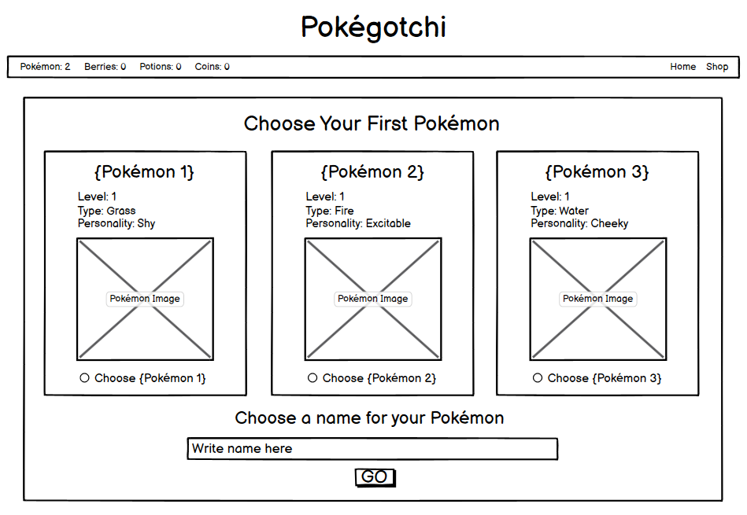 | 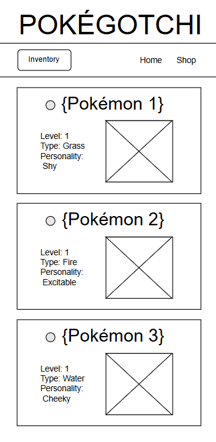 |

### User Collection Wireframe

| User Collection Page on larger screens (laptops & larger): | User Collection Page on smaller screens (mobile & tablet): |
| :---: | :---: |
| 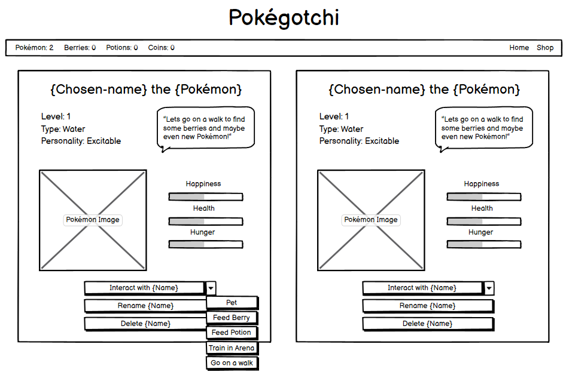 |  |

I also included a small key, which included ideas for what would happen when each button was pressed.

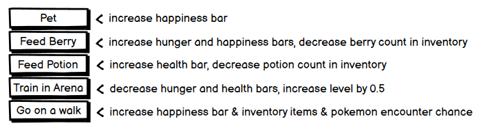

*[TO DO: Finish this section]*

#### Changes I made

I did plan to have a few separate pages at first, which included a Shop/Shelter, but for simplicity, and after realising I would need to use local storage to save the inventory/pokémon lists, I decided to stick to having just the 1 page, and have various pop up modals which can make changes to the that page, i.e. adding a new pokémon or items to the user's collection or inventory.

So because of this change, I decided to remove the `Home` and `Shop` navigation from the navbar and use it only to display the `Inventory` items and buttons. I chose to have important buttons that I didn't want the user to miss in the navbar too, and changed the order, so that any buttons were on the left, and the less important `Inventory` was on the right, as it can't be interacted with. I also removed the `Coins` option from the navbar `Inventory` list and chose to stick to only `Pokémon`, `Berries`, and `Potions`.

**Starter Selection Page**

I changed the layout slightly so that the radio selector was at the top, above the pokémon name, and details like the type and personality were under the image. I removed `Level` entirely, as I set all starter pokémon to start at level 1, so it is pointless adding this before it will ever be used, and I wanted the starter description boxes to be as small as possible so that the rest of the steps in the form could be seen.

I chose to also drop the `Type` option from each of the starter pokémon when on a smaller screen, as the options then stack, so I wanted to make them less tall still, so it is clear for mobile users etc. that there are more options below the first one, instead of each option taking up a large portion of, or all of the screen.

I chose to add a `Refresh Personalities` button to the navbar to give the user more control of their chosen starter.

**User Collection Page**

I chose to remove the speech bubble tips from inside each of the pokémon profile boxes and instead have a carousel of tips along the footer to help advise the user instead.

I reordered the status bars and `Interact` button options so they matched in order, making sure the `Train` option was at the top as this is the option that will be needed first to progress in the game to get to unlock more pokémon encounters. I also added descriptions of which interaction affects which status bar so it is very clear to the user how to manipulate each status bar, and leaves no room for guessing.

I changed the `Hunger` to `Energy` as having the hunger bar which increases when a pokémon is fed didn't make sense.

I also changed the order of the `Rename` and `Delete` buttons so the colour would alternate, as I felt pink suited the options that are normally red, like delete or cancel, which I tried to stick with in all my button colouring throughout the game, including in my modals.

I also changed `Delete` to `Release` so the game is more child friendly.

I chose to move the `Go For A Walk` button to the navbar instead of in the `Interact` menu, as this is a key component in playing the game and I felt it was too hidden inside a dropdown button and should be visible and clear always when in the User Collection stage.

---

# Design

## Typography/Fonts

I wanted to pick a heading which felt similar to the style of 'Tamagotchi', so I used `Google Fonts` to explore options. Using their preview tool, I tested the phrase "Pokégotchi" (which will be shown at the top of the page) to ensure it looked just right, especially the `é` character, which appeared odd in some fonts. I ultimately chose `Monofett` because I felt like it looked very similar to the round look of a physical tamagotchi and almost felt like it was designed specifically for a project like this.

For the main font, I wanted a simple, clear, and unfussy font that would be easy to read but still look youthful and fun. Again using `Google Fonts`, I browsed sans-serif options, this time testing with the male and female symbols as I know some of the pokémon will have them in the name, so the font I chose needed to support these, and a few of Google fonts don't support some symbols. From the ones where the symbols looked good and aligned well with the text, I selected `Dongle` as the best suited for this website's needs.

| Header Font | Paragraph Font |
| :---: | :---: |
| 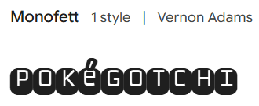 | 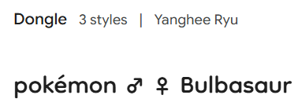 |

I did notice with my paragraph font `Dongle`, that the line height was larger than looked good when the text was on 2 or more lines. I amended the line-height to `1`/`0.8` in a few different places, which fixed this.

| Without line-height adjustment | With line-height adjustment |
| :---: | :---: |
| 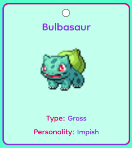 | 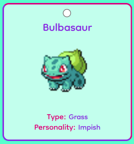 |

## Colour Scheme

I researched Tamagotchi and found that the colours they used were teal, purple and pink.

To be able to use each of these specific colours within my project, I used [ColorZilla](https://www.colorzilla.com/), which is a Chrome extension that allows you to select specific colours from a webpage using a dropper tool, to find the specific hex code/rgb code from a Tamagotchi website, then slightly adjusted the colours, making them slightly calmer, ensuring they still complemented each other, so that it would give a more calming atmosphere to the page and appeal to a wider range of users.

I liked Bootstrap's preset navbar colour (slightly off white), so chose to use that in my palette.

I also included black for some of the parts I wanted to make stand out more than the rest, like the text explaining which steps to take next.

For the paler aqua and pink colours, I used the rgba value of the navbar colour and overlayed the colour over the aquamarine colour I had chosen, testing which opacities looked good, but after I finding the right one, I used Colourzilla again to just add the hexcode of that colour to my palette, which I used for individual pokémon profile backgrounds/buttons etc., testing that the coloured text still passed the [WebAIM Contrast Checker Test](#webaim-contrast-checker-test).

Using colorzilla I got the rgb code for my secondary background colour and added the a to make it rgba so I could play around with the opacity: `rgba(248, 249, 250, 0.5` - This shows the colour at 50% opacity.

I then set the background colour to the colour I wanted a paler version of, and changed the background colour of one of my pokemon cards to the new rgba value I had generated. I played around with the opacity for each of the different colours until I found one that looked right, and then used ColorZilla's dropper tool again to get the hex code of these, which I added to my css stylesheet.
I used `rgba(248, 249, 250, 0.9)` on top of `primary-background` to get the hex code for `primary-background-pale`.
I used `rgba(248, 249, 250, 0.2)` on top of `secondary-colour` to get the hex code for `secondary-colour-pale`.

### Font Colouring

I chose the purple and pink from the colour palette, and black for the font colourings for the website.

I chose the black font colour for sections of the website that I wanted to stand out to the user, e.g. for the text in the starter form instructing the user to select their first pokémon, name their pokémon, and on the 'Add To Collection' button.
I also chose to have the tips in the footer carousel black too, so they would stand out as they are handy to the user for information about how to proceed with the game.

<!-- OR (SAME ABOVE AND BELOW) -->

I chose to have the colours for the buttons alternating purple and pink, with the cancel/release buttons being pink rather than purple, as this is closer to the usual red cancel button colour, but ties into the website colour perfectly. I think this is achieved nicely

I made the font colour black for sections of the website that I wanted to stand out to the user, for example the text in the starter form instructing the user to select their first pokémon, name the pokémon, and on the 'Add To Collection' button. I also chose to have the tips in the footer carousel black too, so they would stand out as they are handy to the user for information about how to proceed with the game.


The inventory button and inventory item count I had in a paler pink, as these can't be interacted with, and are only there to inform the user about the items they have stocked, and I wanted to ensure the Go For A Walk button stood out the most in the navbar. I have only used this paler pink colour in the navbar for the inventory items, as it has a consistently near white background, so the contrast will be enough, and in other places (e.g. the pink release button), the background isn't as light.

*[TO ADD: pic for example?]*

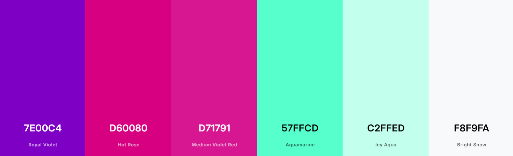

For future maintainability, I defined each colour as a CSS variable (e.g., `var(--colour-name)`). This approach made it easy to update the palette later if needed - changing a single variable would update the colour everywhere it was used.

## Favicon

I chose a simple pokéball favicon, also from PokeAPI which is 30px x 30px, so the perfect size for a favicon.

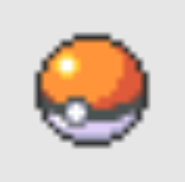

---

# Features

## Site Wide Features

### Title and Navbar

The title of the website is shown on every page, and just below that is a navbar, which has different buttons depending on the user's stage in the journey. I will explain these further below.

### Footer

In the footer, I have added a tip carousel, featuring 5 tips to help the user use the website and progress their game/collection.
These slide to the left, being replaced by the next tip, and once through all the tips, it continues again from the start.

I wanted to add this feature to help users that had become stuck or weren't sure what to do next, and I also have suggestions in the various pop ups to advise the next steps, and how to add more pokémon to grow their collections, e.g. 'If your pokémon is over level 5, there is a chance of encountering wild pokémon on walks with them!'

These help clarify the purpose of the game and ensure the next steps they should take are always clear to the user.

Below the tip carousel, I have added some copyright information.

| Smaller Screen Footer: | Larger Screen Footer: |
| :---: | :---: |
| 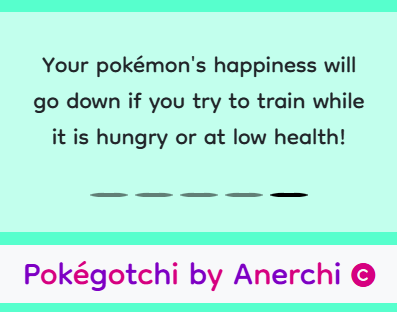 | 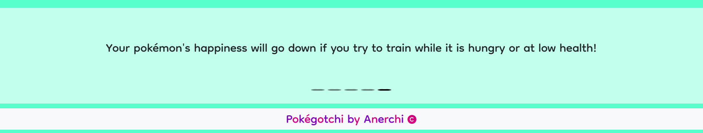 |
| 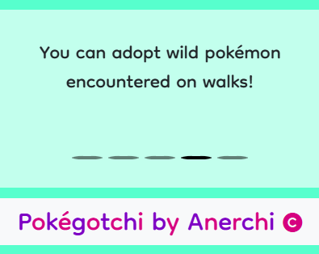 | 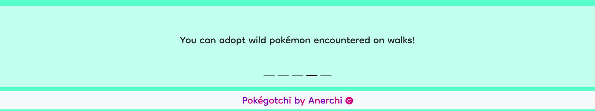 |

I used a photo carousel from Bootstrap and adjusted it to be able to work with text instead, and amended a few other parts of it to work for this project.

I also adjusted each tip's location within the carousel area, so if it is on a large screen where there is only 1 row of text, the tip is nicely centralised with an even gap above and below etc. I did this using `br` tags which appeared or disappeared depending on the screen size.

I adjusted the time each tip stayed on the screen for using Bootstrap's intervals which are part of their carousels, also shown below.

```html
<div class="carousel-item" data-bs-interval="3000">
    <p><br class="d-none d-sm-block">Train with your pokémon to increase their level!</p>
</div>
<div class="carousel-item" data-bs-interval="3500">
    <p><br class="d-none d-lg-block">If your pokémon is over level 5, there is a chance of encountering
        wild pokémon on walks with them!</p>
</div>
```

I ensured that the height was always consistent, regardless of how many lines of text there were in a tip by setting a min-height.

```css
.carousel-item p {
    /* adjusted so height doesn't change on different screen sizes when there are more rows of text */
    min-height: 8rem;
    text-wrap: balance;
}
```

---

### Modals/Pop Up Boxes

I used a lot of pop up modals which were inspired from the old pokémon style games, where pop ups used to take you to different areas or parts of the story.

As I decided to stick with having just 1 page, I decided having different modals could be a fun way to add some excitement.
<!-- more -->

I made a few modal 'shells' in HTML from Bootstrap, and then used JavaScript to edit the content. Where the layout and purpose of the modal was different, I used a different modal to keep things clearer, but for modals where only the text changed, I reused the same modal, for example my alertModal was used for when a pokémon hasn't been selected on the Starter Selection page, and also if the user is trying to use items they don't have in their inventory.

<!-- !!! [explain about needing modalIsOpen - link to problem explained] -->

<!-- !!! [add about adding key press functionality to close modals] -->

Some of the modals lead to other modals, so I made slightly different classes for these 'continuing' buttons, so that the key interactions still worked seamlessly and the variable tracking if a modal is open still worked. [!!! maybe link to issue here too?]

#### Keyboard Shortcuts

ENTER and ESC work with modals.
*Add more here*

## Starter Selection Page
- Shows a form with starter options at initial page load, or when user deletes their last pokémon from their collection.

**Featuring:**
- In the Navbar -
  - 'Refresh Personalities' button
- Main Section (Starter Selection Form) -
  - 3 starter options - each featuring name, image, type (on larger screen sizes) and randomised personality
  - Nickname input box
  - 'Add To Collection' button

When you first open the website, there is a form shown with 3 starter pokémon choices for the user to choose from.
There is also a button to refresh the personalities of the starter pokémon at the top of the page within the navbar.

Inside the form, the steps to follow to select a pokémon are in black font, so it stands out clearly against the other writing and buttons, which are in pink or purple fonts.

The first step is to `Select your first Pokémon:`, and just below this text are 3 starter options which feature an image sprite, the name beneath/beside a radio selection button, the pokémon's type, and a randomised personality picked from an array of 24.
The images are pulled from an API, however, as the names and types of these pokémon are always the same for the first 3 choices, I just typed the type/names into my HTML instead of fetching these as well, to save time on the page load.

The refresh personalities button changes the personality inside these options when clicked, and will still work to change the personality even if a pokémon has been selected.

Once a pokémon selection has been clicked, the styling of the option 'box' changes from a pink and purple border with pale aqua background to a black border and white background so it is clear this step has been done.

Below this is the next step: `Give your Pokémon a name:`, with a text box below to input a name. This is an optional step, and if the text box is left blank, the nickname will default to the pokémon's species name, e.g. 'Bulbasaur the Bulbasaur'. I have set the cursor to start in this box as soon as the page loads so writing a nickname is easier. [TO DO: reword?] I have set any words written in here to automatically capitalise the first letter, and also it has a character limit of 12 [add in pic here].

The final step is to click the `Add to collection` button, so this has black text too to make sure it stands out to the user, as with the other steps.

| Small Mobile: | Large Mobile: | Tablet: |
| :---: | :---: | :---: |
| 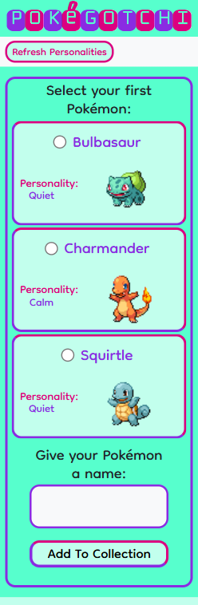 | 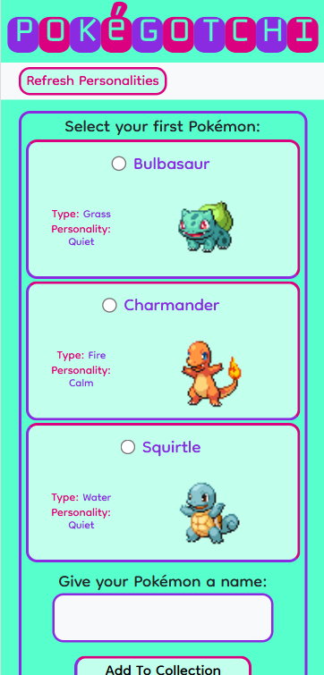 | 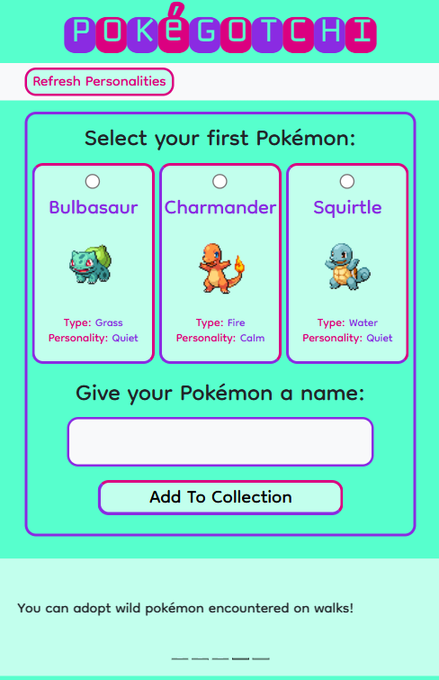 |

**Laptop:**
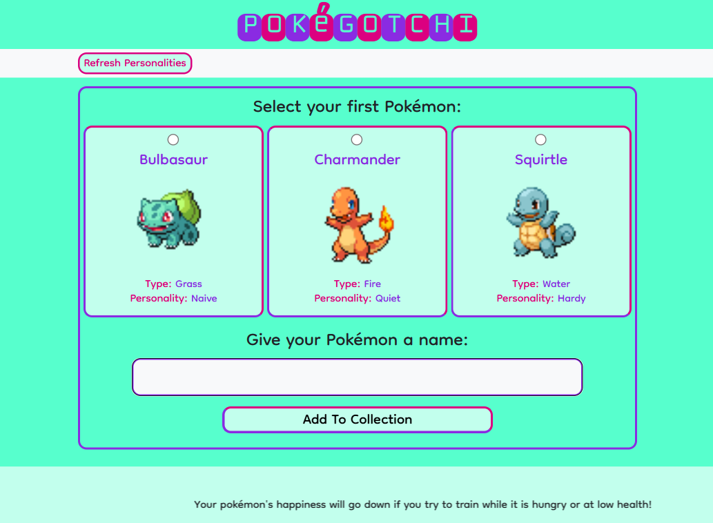

*Note: The tips are only showing as not centralised because I took the screenshot while they were moving, when they stop, they are central.*

Once the first pokémon has been chosen and the submit button has been pressed, I changed the visibility of the form and 'Refresh Personalities' button to hidden and show the user's pokémon collection instead and different buttons appear in the navbar instead (explained below).

This is all done using a function in JavaScript which is triggered by the form submit button being clicked.

There is also a pop up that appears if no pokémon have been selected and the button is pressed, letting the user know that they need to choose one of the 3 starters before they can continue.

| Pokémon not selected error (small screen): | Pokémon not selected error (large screen): |
| :---: | :---: |
| 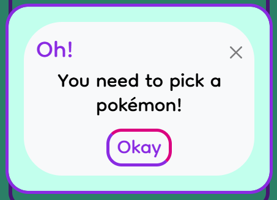 | 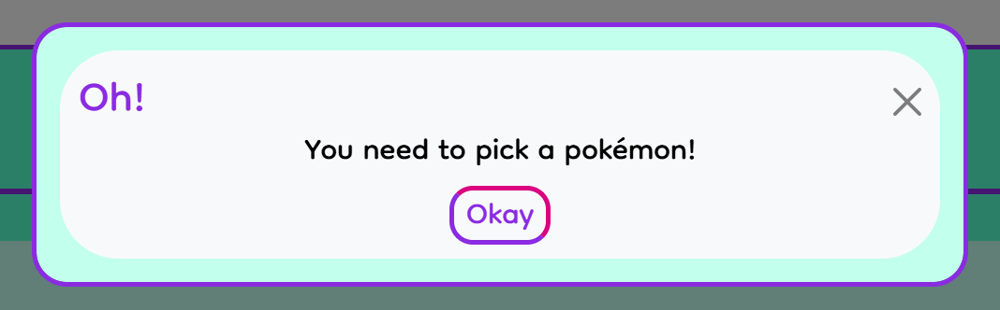 |

## User Collection Page

Once the user has 1 or more pokémon added to their collection, I have set the starter option form and refresh personality button to disappear, a 'Go For A Walk' button becomes visible in the navbar instead, along with the user Inventory, and the new chosen pokémon's profile will now be displayed in the center of the page.
This has details like its Level, which starts at 1, and 3 status bars showing 'Energy', 'Health' and 'Happiness' along with 3 buttons, Interact With, Release and Rename. The pokemon's nickname has been dynamically added to these buttons so whatever the user has chosen the nickname to be is part of the button name, e.g. 'Interact with Bob'.

**Featuring:**

- In the Navbar -
  - 'Go For A Walk' button
  - Inventory count (changes to a button on smaller screens)
- Main Section (Individual Pokémon Profiles) -
  - A Title showing Nickname and Species
  - Smaller details
    - Level
    - Type
    - Personality
  - Image
  - 3 Status Bars
    - Energy
    - Health
    - Happiness
  - 'Interact with' button which opens to show options:
    - Train with
    - Feed Berry
    - Feed Potion
    - Play With
  - 'Release' button
  - 'Rename' button

### Navbar - Go For A Walk Button

There is also a new 'Go For A Walk' button which appears in the navbar beside the inventory expandable button/amounts once there are 1 or more pokémon in the user's collection.

When you click the walk button, a modal pops up and describes details of going for a walk. One pokémon from the user's collection is chosen randomly to accompany the user on the walk.

There are 2 outcomes from going for a walk:
- Finding Items
- Encountering New Pokémon

#### Finding Items

For this option, the accompanying pokémon's nickname is shown in the walk description, along with a backwards image of the pokémon, to look as if it is walking ahead of the user.

A random amount of berries (between 2 and 10(?)), and a random amount of potions (3-5) are generated. If the berry count is 2 or 3, the user will find the generated number of potions as well as the berries. However if the berry count is more, then the user and their pokémon will only find berries.

I did this because I wanted to make the chance of finding potions less, so they increased in rarity.

Once the pop up has come up, there are 2 options, however I chose to only have 1 button (Collect) shown at the bottom of the modal, to encourage the user to keep any items and have them added to their inventory.

Once the Collect button has been pressed, any items that were found on the walk are now shown in the inventory and can be used to interact with any of the user's pokémon using the [Pokémon Profile - Interact Button](#pokémon-profile---interact-button).

The second option is to select the `x` in the top corner to close the modal, which just exits the modals without adding anything to the modal. I have these in all of my modals for consistency.

#### Encountering New Pokémon

Once the pokémon the user is walking with has reached level 5, there is a chance to encounter a new pokémon. The chance is 20% if the pokémon the user is walking with is level 5, and 0% if it is under level 5. If the user has 2 pokémon and only 1 is 5 or above, there will only be a chance of an encounter when walking with that specific pokémon.

When this encounter happens, instead of the walk results pop up, an alert pop up appears saying "You hear a rustling coming from the long grass." with a button below with the text "Investigate". There is also an `x` in the top corner to close the modal, which just exits the modals without adding or continuing the encounter.

I did debate adding another message for water pokémon encounters, but I felt "the long grass" covered it fine, as there could be ponds, lakes or marshes in long grass, and having a description like this makes it feel like more of an adventure. In future I could add other options and have it randomly select one each time.

If the user selects "Investigate", this will trigger another pop up, randomly selecting a pokémon from the first 151 pokémon from PokéAPI, and fetching their image, name and type, and also randomly generating a personality for them from my array of 24 personalities and a level between 1 and 5.

Sometimes if the internet was running slow, the image etc would take a while to load and the user was left with a blank screen, so I added a text option to show first, while the image and name were being fetched from PokéAPI.

The buttons at the bottom give 2 options: `Run Away` or `Adopt`. If the user chooses to run away, nothing happens and no pokémon is added. However if they choose to adopt, a new modal appears with the option to give the new pokémon a nickname. If no nickname is chosen, i.e. the input box is left blank, or the `x` in the corner is selected, the nickname will default to the pokémon's species name, as it does for selecting a starter pokémon. This pokémon is now added to the user's collection and is ready to interact with.

I set the status bars to [TO DO: continue this sentence]. I decided to make the Happiness low as it hasn't been interacted before so might be lonely, and this also encourages the user to use the `Play With` interaction and feel like they have grown a bond with their new pokémon.

*[TO DO: add image table showing loading modal and loaded modal side by side]*

### Navbar - Inventory Display

*[TO DO: Add description]*

### Pokémon Profile - Title showing Nickname and Species

I wanted the Pokémon's nickname to stand out more than the species description (e.g. "the Charmander"), so I set the nickname to 110% of the remaining title's font size. I used `em`, which scales relative to the parent element, and applied it only to the `pokemon-nickname` class, while the rest of the text remains inside the `h2`. Since the `h2` font size changes at different screen sizes through media queries, using `em` ensures the nickname always stays slightly larger (110%) regardless of the overall heading size.

```html
<h2><span class="pokemon-nickname">${capitaliseWords(pokemon.nickname)}</span>the ${capitaliseWords(pokemon.name)}</h2>
```

### Pokémon Profile - Smaller Details

Below the title to the left side are some smaller details which include:

#### - Level

This increases by 1 every time the user clicks the `Train With` option from the `Interact With` dropdown button. A pokémon needs to reach level 5 to be able to encounter new pokémon while on walks.

#### - Type

This shows the 1st type of each pokémon, which is pulled from the individual pokémon details on PokéAPI using a fetch request, and then added to the user's pokémon collection details.

This only displays on larger screens, as on smaller screens there is less space to display the pokémon profiles next to each other, so I have tried to make the stacked profiles as short as possible so that it is still easy to scroll down and see the basic details of each pokémon in the user's collection.

#### - Personality

This is chosen randomly for each pokémon from a collection of 24. There is an option to reshuffle the personalities using a button while the starter selection form is visible, but for encountering wild pokémon on walks, the personality is randomised when they are encountered. The personalities currently don't do anything else, but are a cute addition, and can make the user feel more connected to their pokémon.
In future I could make personalities influence how much a status bar increases or decreases, or the likelihood of a pokémon joining for walks.

*[TO DO: Add more here]*

### Pokémon Profile - Image

The image, like the type and species name in the title are fetched from the specific pokemon details in PokéAPI.

*[TO DO: Maybe add link to an image to show]*

### Pokémon Profile - Status Bars

I decided upon 3 status bars: `Energy`, `Health` and `Happiness`, which can be manipulated using the `Interact with` dropdown button options, these are explained in detail in the [Pokémon Profile - Interact Button](#pokémon-profile---interact-button) section below. Each status bar shows the current amount out of 100.

*[TO DO: Add more here?]*

| Pokemon bars spacing - no gaps | Pokemon bars spacing - even gaps |
| :---: | :---: |
| 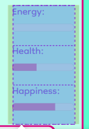 | 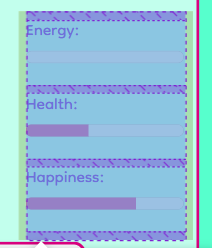 |

### Pokémon Profile - Interact Button

The interact button is clearly larger, with a bigger border, which I coloured a mix of pink and purple, black text and a white background. The text has an arrow beside the text to show the user that this button has a dropdown menu. This arrow changes colour to pink and purple when the button is hovered over with the mouse.

From these menu options the user can manipulate the status bars, and sometimes the level and inventory.
I added an explanation to the end of the button options as to which status etc. is affected so that it is clearer to the user.

There are 4 options:

#### - Train With

This option increases a pokémon's `Level` by `1`, and decreases 2 of the status bars: `Energy` by `10` and `Health` by `20`.
If the pokémon's `Health` or `Energy` are already lower than 20 out of the possible 100, and the user tries to use the `Train With` option, the pokémon's `Happiness` will drop by `10` and a modal will pop up explaining that they are too tired or `...` to train.
I have also added a pop up to let users know when their pokémon has reached level 5 that they are now able to encounter wild pokémon while on walks with them.

#### - Feed Berry

This option increases a pokémon's `Energy` status bar by `15`, and it's `Happiness` by `5`, and removes one of the berries from the user's inventory. Once the bar is full, if a user tries to feed it another berry, an alert will pop up to tell the user the pokémon is now full.

#### - Feed Potion

This option increases a pokémon's `Health` status bar by `15`, and removes one of the potions from the user's inventory. Once the bar is full, if a user tries to feed it another potion, an alert will pop up to tell the user the pokémon is now at full health.

#### - Play With

This option increases a pokémon's `Happiness` and doesn't use any items from the inventory. There is no pop up to tell the user that the pokémon's happiness is full, as I wanted the users to feel free to play with their pokémon as much as they like, however their `Happiness` bar will still stay at 100 once full no matter how many the user selects `Play With`.

### Pokémon Profile - 'Release' button

Pressing this button will trigger a pop up modal asking if the user is sure they want to release their pokémon, with 2 button options - Cancel and Release, as well as an x in the corner, which works the same as the Cancel button, and can also be triggered by pressing ESC.

If you select Remove, or press the ENTER key, the selected pokémon is removed from the user's collection, and the page will either refresh to show all remaining pokémon, or if none are left, the Starter Selection form will reappear, along with the 'Refresh Personalities' button in the navbar, and the 'Go For A Walk' and 'Inventory' will disappear, as it did when the Starter Selection form was shown originally.

### Pokémon Profile - 'Rename' button

This button gives the user the option to change or add a new nickname to any of the pokémon in the collection. When the button is pressed, a pop up modal comes up which asks the user to choose a new nickname for their pokémon, with a text box to type in.

The text box is pre-filled with the current username which makes it easier for small edits, and also reminds the user of the current nickname.

Whether the name the user types in starts with a capital letter or not, when the Rename button is pressed, each word of the nickname will automatically have its first letter capitalised.

I implemented a character limit to the nicknames, so that any names given to the pokémon could never expand outside of the pokémon profile box, no matter the screen size.

I googled what the widest character in most fonts is, which is M or W, and in my chosen font, the W was wider, so I tested with this to find the perfect character limit for my nicknames.

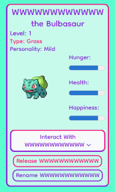

# Testing

---

## W3C Markup/HTML Validation Service

This is the test result from my W3C HTML Validator Test:

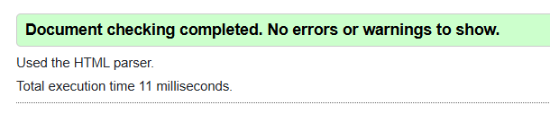

---

## W3C CSS Validation Service

The CSS stylesheet passes the CSS Validation Service.

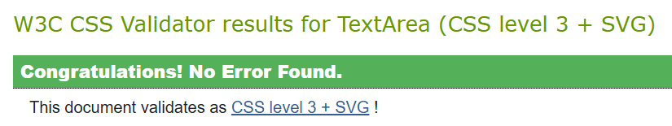

There were some warnings (only 2 different) which are due to using CSS variables and imported stylesheets from Bootstrap, which aren't anything to worry about.

<details>
<summary>*click to see warning messages*</summary>

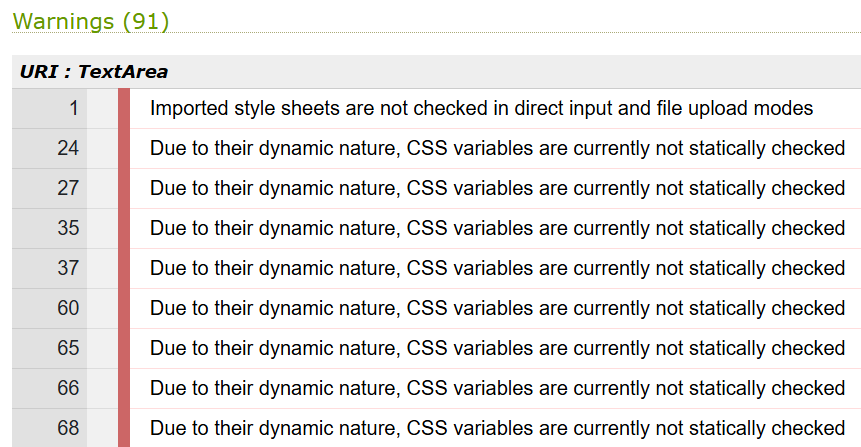

</details>

---

## Lighthouse Performance

These are the lighthouse scores below for each of the pages:

Starter Selection Page:


*[TO DO: Add]*

User Collection Page:


*[TO DO: Add]*

---

## Accessible Web Test

https://accessibleweb.com/website-accessibility-checker/

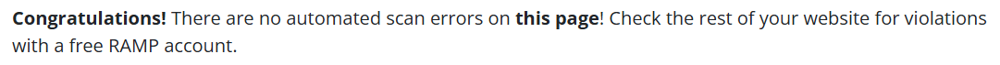

---

## WAVE Test

*[TO DO: Add]*

<!-- These were my test results:

There were **no Errors** or **Contrast Errors**.

|  |  |
| :---: | :---: |
|  |  |

The Alerts above are due to ...

 -->

---

## WebAIM Contrast Checker Test

*[TO DO: Add]*

---

## Manual Testing

*[TO DO: Add table here with the table testing modalIsOpen for various modals from my physical notes]*

<!-- | Test Area | What I'm Testing | Did it Pass? |
| --- | --- |:---:|
| Navigation Links | Do all links navigate to the correct page/section? | Yes |
| Navigation Links | Do all buttons lead to the intended destination? | Yes |
| Forms | Does all the validation work, so the form can't be submitted without all required fields filled and with valid/the correct characters? | Yes |
| Forms | Once submitted does it navigate to the correct page/stay on the right page? | Yes |
| Responsive Design | Does the website adapt as intended at all screen sizes? | Yes |
| Responsive Design | Does the burger menu work as it should, including closing when a link has been clicked? | Yes | -->

---

# Fixed Issues

Added text-wrap as a class to the interact with pokémon dropdown menu as by having the button as a dropdown toggle on bootstrap, that adds nowrap for some reason when that class is used ...

*[TO DO: Add more, and add from below in To Delete section]*

---

### Multiple modals/pop ups can be open at the same time (multiple step fixes)

*/ stops the user from breaking the game by clicking faster than the modals could pop up*

<details>
<summary>Issue & Solution:</summary>

*Write issue from these: (REMOVE AFTER)*
- When using enter to press investigate button it is sometimes really slow
  - If the investigate button is clicked and loading then the walk button can be pressed again and then there are multiple modals at once, including new rename modal, so need to disable being able to click on the buttons while a modal is open.
    - If the modal is slow to open it might not show a modal open, so figure out that too.
- Issue with multiple pokémon appearing when enter button is clicked, the surprise encounter/disturbance modal with investigate button isn't closing the modal, or will make 2 pokémon appear sometimes. Selected second one by accident and first was gone.
- When press enter and new nickname pops up, the investigate modal is still up sometimes.
- When pressing enter to adopt a pokémon and clicking fast, sometimes there are 2 options and even if the first is selected by clicking adopt and the second one too, only the second one logs

*(REMOVE AFTER)*

**Issue:** When the 'Go for a Walk' button is clicked, a modal is triggered, but if this happens too slowly and the user clicks the 'Go for a Walk' button again, another modal opening is triggered, resulting in more than 1 modal being open at a time and this can get very messy/confusing.

**Solution:** I need to stop the button working if there is already a modal open.

I decided to do this by creating a boolean variable which will change from false to true when modal is open, and then disable the 'Go For A Walk' button when this is variable is set as true.

Step 1:
I decided to call this variable modalIsOpen, which automatically is set to false, but can be changed to true within functions that open on button clicks. I kept this global so that it can be altered within any function in my code.

```js
let modalIsOpen = false; // Used to ensure multiple modals can't be opened at the same time
```

Step 2:
I then go through my code and change this variable to true within all of my functions at the time a modal is opened.

**Example:**
Existing line of code:
```js
$("#walkResultsModal").modal("show");
```
Line I add beside it:
```js
modalIsOpen = true;
```

Step 3:
Now I need to make sure that the variable is switched back to off whenever a modal is closed. I can do this in a similar way by searching my code for any lines that close a specific modal, so instead of saying `"show"`, it will say `"hide"`, and then I added a line similar to the one above, but with `true` changed to `false` instead.

Step 4 (Fix issue with modalState not being changed to closed when cancel button on modal clicked):

During the previous step, I noticed there were far less lines with modal.("hide"), compared to modal.("show"), so I added less of this line: `modalIsOpen = false;`, than I did this line: `modalisOpen = true;`.

Because of this, I decided to write up all functions and how they could be opened and closed, and did some manual testing, adding `console.log(modalIsOpen);` to my event listener for any keypress to check the boolean state of the modalIsOpen variable at various stages.

*[ADD: link to table in testing section]*
*[TO DO: Add table into testing section and a link to it here with the table from my physical notes]*

Step 5:

I added this step to tidy my code by putting the repeated code which changes the state of modalIsOpen into 2 functions, including one which I created above - updateModalStateToClosed.

So instead of having this line of code - `modalIsOpen = false;` - in various functions throughout my script file, I just called the function, which is clearly named, and saves writing the repeated code again, keeping my code DRY.

I also did the same with a new function called updateModalStateToOpen, which does the opposite, changing the state to `true`.

Added functions:
```js
function updateModalStateToClosed () {
    modalIsOpen = false;
}

function updateModalStateToOpen () {
    modalIsOpen = true;
}
```

Inside other functions before:
```js
$("#alertModal").modal("show");
modalIsOpen = true;
```

After:
```js
$("#alertModal").modal("show");
updateModalStateToOpen();
```

Inside other functions before:
```js
$("#releaseModal").modal("hide");
modalIsOpen = false;
```

After:
```js
$("#releaseModal").modal("hide");
updateModalStateToClosed();
```

Step 6

I then discovered that the state didn't change when closing alerts (such as alerts that the pokémon needs a berry).
Also, when any modal was closed using the cancel/closing x in the corner.

I had previously targeted these buttons that closed/cancelled modals with a class: `cancel-modal-button` before, so to fix this issue, I decided to also target this class to turn the modalIsOpen state to false, to fix the above issue.

```js
    // Event Listener to change state of modalIsOpen when any modal is closed using a 'cancel modal' button
    $(".cancel-modal-button").on("click", updateModalStateToClosed);

    // Function to close modalIsOpenState
    function updateModalStateToClosed () {
        modalIsOpen = false;
    }
```

Step 7 (Fix issue with modalState not being changed to closed when modal is closed by clicking outside of modal):

Another issue I found during testing is if the user clicks outside of the modal (only for modals that aren't static), which closes the modal but again hasn't triggered the modalIsOpen boolean state to be changed back to false.

The modals that this is possible with are the alertModal, releaseModal, renameModal, and the wildRenameModal. All the other modals are static, so will stay open unless either a button has been clicked to close it/open a new modal, or a key has been pressed to trigger a click, which I have already fixed to change the modalIsOpen state in the steps above.

I decided to make all my modals static, instead of just some, which will fix the problem, and probe the user to interact more with the options.

*[TO DO: maybe add more explanation to this]*

Step 8:

Tidied `handleModalKeyActions` function, adding check for `modalIsOpen` variable.

<!-- I implemented a conditional check to ensure the modal element was present in the DOM before attempting to access its child elements. This prevents potential null pointer exceptions and ensures the script doesn't crash if a keydown event occurs while no modal is active. -->

*[Also add -]* I could have changed .show to looking at if modals have .hidden (and add class to and from modals) if I didn't want to use Bootstraps .show class, like I did with the starter options form/walk button etc, but I decided to do it this way to show my understanding of Bootstraps modals/classes.

Step 9:
Once I know this works as intended, I look at fixing the main problem (Multiple modals/pop ups can be open at the same time), and a check to the start of any functions that can trigger a modal to open, to check if there is already a modal open, and if so, abort.

This is how I do this...

```js
// a safeguard to prevent the multiple open modals issue
if (modalIsOpen) {
     return; 
}
```

I also added this safeguard code to the actionBerry, actionPotion and actionTrain functions, as an alertModal pops up if the pokémon's health/... is low, or the user doesn't have any berries or potions.

I didn't add the safeguard code to the walkDisturbance, surpriseEncounter or addWildPokemon (which also trigger modals to be opened) as they are only triggered after/because of the the goForAWalk function, which the safeguard has already been added to.

[MAYBE TO DO - add why I didn't add to others?]

</details>

---

### Screen 'jumps' when interact menu option is used & multiple ids with the same value

<details>
<summary>Issue & Solution:</summary>

**Issue:** I would like to be able to interact with a pokémon in my collection (eg. feed a berry), without the whole page being refreshed, causing a 'jump' in the visual. I only want to change the status bars (and inventory amount if necessary).

The problem comes from the function `displayUserPokemon` - which reloads the display for ALL the pokémon in the collection everytime it is called.

Currently the `actionTrain`, `actionBerry`, `actionPotion` and `actionPet` functions all call the `displayUserPokemon` function, refreshing the entire collection, when each function actually only changes 1 or 2 of the status/progress bars of 1 pokémon, one of the berry/potion counts displayed in the navbar, and sometimes the level, so it would run quicker if I only changed these specific things rather than reloaded the whole user collection of pokémon.

I also realised when looking into the HTML in my script file used to generate/display a pokémon in the user's collection, I had ids for each of the status bars, which meant that if the user has more than 1 pokémon in  their collection, there will be multiple ids with the same name, which is not ideal!

**Solution:** To start with, I changed the `id`s of the progress bars to include the uniquely generated index number of each pokémon, to solve the last problem addressed above, and also make it easier to target a specific status from a pokémon to be updated.

I then addressed the first problem, starting with the `actionPet` function first, as this is the most simple action function, and the only change is to the happiness bar.
[...add code...]

Then I changed the `actionBerry` and `actionPotion` functions, as these both target 1 status and 1 item from the inventory, so the changes to the code is almost identical.
[...add code...]

Lastly, I changed the `actionTrain` function, as this was the most complex function, affecting 3 status bars, and the level, which will need to be displayed too within the function.
[...add code...]

**Possible other changes:** I could have updated these action functions to change the specific inventory item too instead of running the `updateInventory` function which targets all 3 inventory items, but I decided to leave it as it was as it is a relatively quick and easy to run function which shouldn't cause any visual 'jumps' like `displayUserPokemon` did. I could have also added similar changes to the `renamePokemon` function, but as this runs from closing a modal, having the page refresh doesn't look odd or unnatural, like it did when interacting using the interact button options.

</details>

---

### Couldn't change the line height of a label

<details>
<summary>Issue & Solution:</summary>

**Issue:** The title of the [status bar] couldn't be edited, for example. adding different number line heights was doing nothing.

**Solution:** A label is automatically treated as if it is `inline`, like a `span` rather than a `div`, so the `display:` needed to be changed to `block` or `inline-block`, which allowed me to edit things like the `line-height`.

</details>

<!-- ---

### [Fixed Issue]

<details>
<summary>Issue & Solution:</summary>

**Issue:** [Issue.]

**Solution:** [Solution.]

</details> -->

---

# Deployment

The following steps outline how I created my project and cloned it locally from GitHub. You can use equivalent tools, apps or platforms based on your own device or preferences.

**GitHub**

- Firstly, I made a new repository in GitHub from the code institute template, with my chosen name for my project, which is `pokegotchi-using-pokeapi`
    - I ensured that this was in *snake case*.

- I then copied the GitHub repository URL from the top of the page, as shown below.

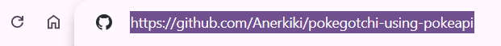

**File Explorer**

- Once I had made a new repository, in 'File Explorer' on my local Windows device, I then navigated to the folder I wanted my project to be in, and right clicked to 'Open in Terminal'.

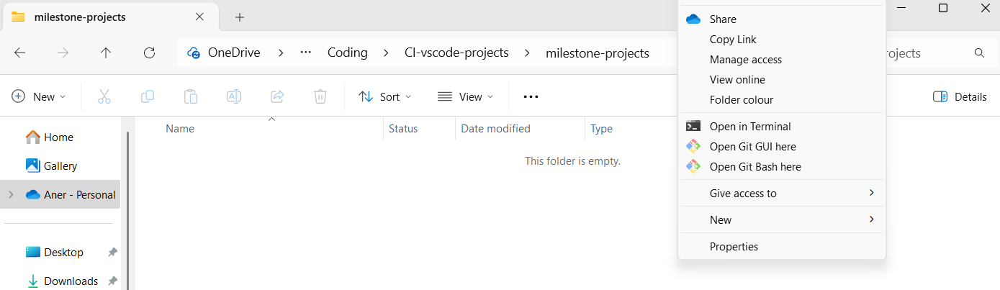

**Terminal**

- Then, after making sure I was still in the correct folder, I typed `git clone [link copied and pasted from GitHub address bar]` into the Terminal.

- Now a new folder will have been added to your 'File Explorer' which is linked to the GitHub repository.

**VS Code**

- Next, I opened the new project folder in my chosen IDE (in my case this is VS Code) and pushed to GitHub to ensure the connection had been made.

Then I set up the initial project structure:

- I created the main html page: `index.html`, and created the `assets` folder which I added a `css` folder `js` folder, and an `images` folder inside.

- I added a `style.css` stylesheet inside the `css` folder and linked it to my `index.html` file, testing that the link had worked.

- In my custom CSS file (`style.css`), I defined the color palette and font styles as CSS variables to ensure consistent branding and design.

- I added a `script.js` file inside the `js` folder and linked it to my `index.html` file at the bottom of the body tag, testing that the link had worked.

- I then integrated Bootstrap, jQuery and Font Awesome by linking them into my `index.html`, and also imported my chosen Google Fonts to the `style.css` stylesheet by adding the import URL to the top.

- After verifying that all dependencies and styles were correctly linked, I staged, committed, and pushed these initial changes to the GitHub repository.

---

# Credits

## Technologies Used

### [GitHub](https://github.com/)
- I used GitHub to store and manage the source code for this project and track changes.

### [VS Code](https://code.visualstudio.com/)
- I used VS Code as my IDE to code and develop this website and to push to GitHub.

### [Google Fonts](https://fonts.google.com/)
- I used this to find and create an import URL so that I could use my 2 chosen fonts Monofett & Dongle.

### [Font Awesome](https://fontawesome.com/)
- I used Font Awesome to add icons to the website so that they could be coloured to match my design, specifically gender symbols in the Pokémon name Nidoran.

### [Bootstrap](https://getbootstrap.com/)
I used Bootstrap templates for my navbar, modals, tip carousel, and flexbox for interchangeable sizes, e.g. for the Pokémon Profiles and Starter Selections.
*TO DO: Check if flexbox is right*

### [Google](https://google.com/)
- I used Google to research features, troubleshoot issues, and find solutions for implementing various aspects of the website.

### [Notion](https://www.notion.com/)
- I used Notion to write up ideas, to do lists/issues that needed fixing, and paste screenshots, images and their links, etc.

### [ColorZilla (Chrome Extension)](https://www.colorzilla.com/)
I used ColorZilla to extract precise color codes from images and web pages, which I modified to use in my design.

### [Balsamiq](https://balsamiq.com/)
- I used Balsamiq to make my wireframes.

### [PokéAPI](https://pokeapi.co/)
- I used data from the PokéAPI API for pokémon names, types and images.

---

## Images Used

All images in this website are taken from [PokeAPI](https://pokeapi.co/), and are the property of Nintendo and The Pokémon Company.

---

## Acknowledgements

I would like to thank the team at Code Institute, the members of the Slack/Discord community, and my tutors/mentors for all of their help and support throughout this course and project.

---

# Other

## Future Enhancements

Things I could do in the future to enhance the website:
- Add pokémon collection and inventory to local storage so that if window is closed/refreshed the user's pokémon collection and inventory remain.
- Add genders.
- Add evolving pokémon.
- Add a pokédex with previously owned pokémon checked off.
- Make personalities influence how much a status bar increases or decreases, or the likelihood of the pokémon joining for walks.
- Add other areas for walk encounter text other than just long grass.
<!-- In future I could add other options and have it randomly select one each time. -->

---

<!-- # !IMPORTANT! - Delete ALL below from README after


---

## Add to README

Consistent variable/id/class names
  - all ids and classes are all in kebab-case, with the exception of modal ids which are in camelCase

---

# To Dos


*TO DO: Reword below*

## Multiple Modals Opening Simultaneously

**Issue:** When rapidly pressing ENTER to close modals triggered by the 'Go For A Walk' button,
two modals would sometimes appear at the same time, despite the `modalIsOpen` flag being designed
to prevent this.

**Cause:** The event listener that sets `modalIsOpen` to `false` was watching all
`.confirm-modal-button` clicks:

`$(".cancel-modal-button, .confirm-modal-button").on("click", updateModalStateToClosed);`

Some buttons don't close a modal - they lead directly into the next one (e.g. "Investigate"
and "Adopt"). These were using the `.confirm-modal-button` class, so clicking them was
incorrectly setting `modalIsOpen` to `false` before the next modal had opened, leaving a
window where a second modal could be triggered.

**Fix:** A new class, `.continue-modal-button`, was created for buttons that lead to another
modal rather than closing the flow entirely. These are excluded from the event listener above,
so `modalIsOpen` stays `true` between chained modals.

The keyboard handler also needed updating - it previously only looked for `.confirm-modal-button`
when ENTER was pressed. Since some buttons now use `.continue-modal-button`, the selector was
updated to look for either:

Changed from:
`currentlyOpenModal.querySelector('.confirm-modal-button').click();`

To:
`currentlyOpenModal.querySelector('.confirm-modal-button, .continue-modal-button').click();`

The comma here acts as an OR — it finds whichever button class is present in the currently
open modal.

---

## ESC Key Leaving `modalIsOpen` as `true`

**Issue:** Pressing ESC to close a modal was dismissing it visually, but Bootstrap was handling
the keypress itself rather than the custom JavaScript, so `updateModalStateToClosed()` was never
called and `modalIsOpen` remained `true`. This caused the "Go For A Walk" button to stop working
until the page was refreshed.

**Fix:** `data-bs-keyboard="false"` was added to all modals, which stops Bootstrap from handling
keyboard events itself and lets the custom JavaScript handler manage ESC and ENTER behaviour
consistently across all modals.

---

## TypeError When Pressing ESC on Rename or Release Modal

**Issue:** Pressing ESC on the rename or release modal threw the following error:

`Uncaught TypeError: Cannot read properties of null (reading 'querySelector')`

**Cause:** The keyboard handler was calling `.querySelector()` to find a button inside the
currently open modal, but if no modal was open, `currentlyOpenModal` was `null` — and calling
`.querySelector()` on `null` causes a crash.

**Fix:** A null check was added so the keyboard handler only runs if a modal is actually open:

```js
if (modalIsOpen && currentlyOpenModal) {}
```


*TO DO: Reword above*


!-- CURRENTLY WORKING ON: ---------------------------------------------
**Write up modal issue fix into readme solved issues**

After fixing the above issue, I ended up with another issue. Sometimes 2 modals would still appear simultaneously while I was rapidly clicking the walk button and using the ENTER key to progress/close modals. This should not have happened with the button being disabled while modalIsOpen is true.

Using my console.log to show the state of modalIsOpen when a key is pressed, I discovered that while the wildEncounterModal is open, the modalIsOpen is still showing as false, when it should have been 'true'.

The event listener was changing the state through the classes I added to all modal buttons, however, when a modal leads to another modal, I don't want this to update the modalIsOpen state, so I decided to make a new class name, called .continue-modal-button, which won't be triggered by this event listener, so the state will remain the same.

I decided to change the class for these 2 buttons, which don't close the modal, but lead straight to another modal being opened from `confirm-modal-button` to `continue-modal-button`.

`$(".cancel-modal-button, .confirm-modal-button").on("click", updateModalStateToClosed);`

Then
However this caused the problem that the ENTER key would not work to press the confirm/continue button button (in this case investigate and adopt) so I also needed to amend the query selector within the ... function to also look for and press either the the continue-modal-button OR confirm-modal-button, whichever is present in the currently open modal.

!-- I now have to amend the function that controls the ENTER and ESC keypresses and include in the ENTER command the class continue-modal-button as well as just confirm-modal-button. --

Changed from this: `currentlyOpenModal.querySelector('.confirm-modal-button').click();`
to this: `currentlyOpenModal.querySelector('.confirm-modal-button, .continue-modal-button').click();`
The comma acts like an 'OR', so this now looks for either button class.

Now this event listener:
`$(".cancel-modal-button, .confirm-modal-button").on("click", updateModalStateToClosed);`
won't change the state of modalIsOpen if the `continue-modal-button` is now pressed, on a modal which always triggers another modal to open.

**Next Issue**

Another issue with this modal being open and trying to press keys to close but modalIsOpen state is set to false, and keys not working

When ESC is used to close rename modal, the modal is open state is still showing as true, should be false

The fix:

Adding `data-bs-keyboard="false"` to all modals to this line: `<div class="modal" id="alertModal" data-bs-backdrop="static" data-bs-keyboard="false" tabindex="-1" aria-hidden="true">`

**NEW BUGS TO FIX ALSO:**
- Also found new issue, when on renaming wild pokémon, pressed esc (i think, or x) and modalIsOpen is still set to true, so go for a walk button won't work
- Enter/esc doesn't work for 'Well hello there' modal, for adopt/run away/x options

- Also fixed this issue when pressing ESC on rename (or release) modal?:
script.js:199
Uncaught TypeError: Cannot read properties of null (reading 'querySelector') at HTMLDocument.handleModalKeyActions (script.js:199:36)

!-- CURRENTLY WORKING ON: ---------------------------------------------

## Next:
!-- Then WORKING ON: --------------------------------------------


### Then:
- Add a modal alert to tell users that the pokémon is unhappy and suggesting to play with it
- Change 'go for a walk' button text to be 'Walking' when investigating a wild pokémon and change back once modals are closed
- Remove the walk modal title and x on mobiles so that the full modal is visible with image and buttons are more accessible
- Changes go for a walk button text so the user knows the click has worked
  - similar to `$("#add-first-pokemon").prop("disabled", true).text("Adding...");`
- Leave only descriptive code and console.log
- Work out if this input needs a value="", like nickname has
<label for="wild-new-nickname" class="main-modal-content">Choose a nickname for your new pokémon:</label>
<input id="wild-new-nickname" type="text" maxlength="14">
## Bugs to Fix:
- Bug discovered after testing:
  - When I delete last pokémon and the form comes back up, on mobile/small screen it stays at the bottom and I have to scroll up
- Problem with aria-hidden="true" - shows up in console when using go for a walk/enter/esc/modals

- This issue still needs fixing (appears in console) when modals are closed sometimes:

(index):1

Blocked aria-hidden on an element because its descendant retained focus. The focus must not be hidden from assistive technology users. Avoid using aria-hidden on a focused element or its ancestor. Consider using the inert attribute instead, which will also prevent focus. For more details, see the aria-hidden section of the WAI-ARIA specification at https://w3c.github.io/aria/#aria-hidden.

Element with focus: <div.modal fade#releaseModal>

Ancestor with aria-hidden: <div.modal fade#releaseModal>
#### Style To Dos:
- Rename this?
```css
.main-modal-content {
    color: black;
    font-size: 2.5rem; /* make this smaller on smaller screens? */
    line-height: 0.8;
}
```
- Radio buttons aren't centralised in starter form when all 3 are next to each other on a smaller/medium screen
- Make Add to Collection (starter form) and Go for a Walk buttons larger/bigger text (match inventory items, so it looks aligned)
- Work on h3 modal title going too small at smaller screen?
  - also work out if all modal titles should be the same size - all h2 or h3, not both
- Change location of dropdown to be to the right of the button, instead of in line with it
- Look at modal content font sizes
```css
.main-modal-content {
    color: black;
    font-size: 2.5rem; /* make this smaller on smaller screens? */
    line-height: 0.8;
}
```

- Look at later:
```css
.modal-content button {
    border: 4px solid var(--secondary-colour);
    border-radius: 20px;
    text-transform: capitalize;
    /* might not need all of above - look at later */
    color: var(--secondary-colour);
    background-color: var(--tertiary-colour);
    margin: 0 15px;
    font-size: 2.5rem;
}
```

##### Check is done:
- Increase padding in go for a walk to match inventory
- Remove h3 from buttons - done - check the size of the text isn't too small
- check if text-wrap: balance; negates the need for nbsp - LOOK INTO LATER */
- Reduce line height of modal titles to same as other titles
- When using enter to press investigate button it is sometimes really slow - check if this is still the case
###### Less Important/If Time

- Check if need level class on pokémon profiles, as have added id with specific index numbers.


- Modal images are a bit large (wild pokémon image at least) Look into comment below:
```css
/* Wild encounter modal image */
.wild-pokemon-image {
    object-fit: cover;
    object-position: center;
    height: 680px;
    /* 'width: 100%' needs adding to prevent images shifting to the right on small screens */
    width: 100%;
    /* LOOK AT LATER: Maybe change to 80% here for when very large and 100% at a smaller media query (500-600?) */
}
```

- Maybe rename pokemon-nickname id to starter-nickname/original-nickname or something so it's clearer?
```css
#pokemon-nickname, #new-nickname, #wild-new-nickname {
    max-width: 100%;
```
- Add if pokémon is too unhappy (to train) modal pops up and advises you to play with it to increase its happiness
- Change laptop+ screen to show pokémon collection full width instead of just in center
```css
main .container {
    min-width: 90%;
}
#pokemon-collection {
    min-width: 100%;
}
```
- Remove radios now that can click on the pokémon box anywhere?
- Add specificity to pokémon that needs healing/feeding - "Your Pokémon {nickname of one with 0 status bar} needs feeding"
- Maybe add in nickname (specificity) to modals for deleting and renaming pokémon
- Sometimes if I accidentally highlight the text in a modal, when that modal re-opens the text is still highlighted - fix this so it isn't.
- When testing on my phone, Title spreads to edges of screen - add padding to sides
- Have clicking off one of the starter boxes deselect the selected starter
- Add listener to make go for walk button be clicked when w is pressed
  - but make sure it only works if walk button does not have the class hidden
- Add in 2nd type if there is one in PokéAPI & join with " & "
- Merge all modals to one?
- Add in pressing the letter 'w' works the same as clicking the 'Go for a walk' button
- If there is only 1 pokémon then remove the class that shrinks it to col-6 (col-md-6?) so that it stays full screen
  - have a max-width though so it doesn't look weird
- Change colour of progress bars
- When collect button has been clicked, there is a blue background on the button that shows up - change this to a colour from palette
- Reduce size of input box
- Make interactions/status bar changes slightly different for different personalities
- Add evolving - once you get pokémon leveled up enough
- Add type to wild encounter function

### Ideas
- Image changes with low bars
  - eg. if low health, pokémon image is faded
  - if happiness bar is low, pokémon image is facing away
    - could be done by adding backwards image to userCollection objects
- Have chance of being able to adopt wild pokémon not at 100%
- Have a comment relating to a wild pokémon's personality - if personality is 'Hasty', have it jumping around etc etc.
- If pokémon image is clicked on, a speech bubble will appear and give hints. or say that it's hungry/needs healing etc if any bars are low

#### Done
- IMPORTANT: Add labels to radio buttons
- FIX: Issue with progress bars not filling full width next to image and interact button/progress bars being too long/short sometimes
- Add onclick handler to add 'checked' to radio of starter parent element clicked
  - Maybe have selected pokémon background light up/change colour when radio is selected
- Change text inside add button while loading to “Adding…” or similar
- stop it adding another when double clicked
- modals appear in different places on the screen - alerts are center, and walks are top - make all center
- in `releasePokemon` - clear the input box and deselect the radio button selection when last pokémon deleted and form comes back
- Removed fade from walkResultsModal, as it is a static modal so can't be missed, and then can have more immediate rewards
- Change 'pet' to 'play with' as looks nicer and is the same amount of words as other actions so looks neater
- add backwards image to walks
- Make sure add enter key to be able to adopt/interact/say okay on modals
- Add finding pokémon feature on walks for pokémon that are above a certain level and add that into walk pop up modals/footer so players know.
  - whether one shows up is linked to level of pokemon joining on the walk
    - link this in via js - if [joining pokémon level > 10] then chance to encounter pokémon
  - Put a footer in and make sure is always stuck to bottom
    - Add to footer notes/tips about how to get more pokémon
      - Tip: to have a chance to find pokémon on a walk, train with your pokémon until over level 10 and then go for a walk with them.  
- Stick footer to the bottom of the page
- Link up rename button and make functions to change name
- When starter pokémon is selected, change the colour of the background/border to something obvious
- to fix - actionTrain - if health is on 0 - there should be an error/alert modal - checkForStats() one shown not actionTrain()
- fix heights of starter boxes so that even if personalities goes over 2 lines the boxes still line up at the bottom
- When delete last pokémon, refresh the starter choices too - make delete button also click refresh personalities button
  - Did this by calling the addNewPersonalitiesToStarters function in the releasePokemon function if it is the last one in collection
- Check why button in navbar is working seamlessly to refresh pokemon yet one in main section reloads the whole page - not linked to function
  - Fix: the button didn't have type="button", so pressing the button was acting as if it was submitting the form, refreshing the whole page, adding this fixed the issue
- If health is at 0, level should not go up
- remove arrow in dropdown menu button for interacting with pokemon (I did this by removing the class dropdown-toggle from the button)
  - replaced with fontawesome arrow
- Sort focus - html added (autofocus to end of input tag): <input id="starter-nickname" type="text" class="col-10" autofocus> 
- Add refresh personalities buttons back when last pokemon has been deleted
- Check if add to collection text is being added twice in the 2 functions it is added to. use search to find. Remove from 1.
- Remove the small border between sections in modals
- If add to collection starter button is clicked while still adding (says Adding...), then another duplicate is added.
  - maybe add a modal that is static and remove .fade so nothing else can be clicked once open?
- Issue with rename input box looking too wide under about 500px
This hadn't fixed it: #renameModal #new-nickname {
    max-width: 80%;
}
- Add in enter and esc to work instead of okay/cancel
- (Commit f6d4fc6) Remove most cancel buttons from all modals and change to an x in the corner
  - in "wildEncounterModal" - remove the run away option and change to an x in the corner, only have 'investigate' button at bottom of modal
- Amend layout of comments so they are always BEFORE - not after
- Add a limit to nickname renaming inputs
I tested a few different nickname sizes, with all capitals, the widest letter appeared to be capital U, and the number that seemed to not extend out of the box with all this letter was 12, so that is what I set the maxlength of the 2 input boxes to.
- Fix wild rename input appearing next to label for it sometimes, not under it, how it looks better
FIXED - input box not going below label - added a min-width to inputs of 60%
- Add code to script to prevent multiple starter pokemon being added if page is slow to load
- remove h3 from label tags
  - Done in commit - "Remove h3 tags from labels but keep the styling the same"
- Change line height for labels for inputs, so that there aren't such big gaps between lines when on more than 1 line
  - commit msg: Reorder/order stylesheet for clarity, fix line height/modal-inner padding issues
- Classes don't match in starter pokemon (and below)
- Screen 'jumps' when berries are fed to pokemon/interact menu is used
- When on laptop size, user collection is too condensed in the middle of the page and only shows 2 pokemon per row.
  - Changed the bootstrap class from container to container fluid once a starter has been chosen.
  - commit msg: Fix image stretching issue for starter images, and improve layouts of starters and pokemon collection
**Add to readme**
- Choose a slide time and match all - 4000
  - I adjusted the times dependant on how long the text in the tip was and asked friends and family to check if it seemed long enough
- set the walk results as a static backdrop modal, and it is the only one, as I noticed the title was an id, so if I replicated this elsewhere I would have to change this, which could be a Potential future problem, So I changed the id.
---
- You should still be able to feed a berry to or pet your pokemon, even if the health is at 0, without the modal coming up.
This should only come up when trying to battle.
**Issue:** The alert from checkForLowStats is coming up (for 0 health - "your pokemon need healing with potions") -
even when just trying to pet or feed a berry to pokemon, which I don't want it doing
This may also fix the issue with the wrong modal coming up when trying to battle with 0 health
**How I fixed it:**
- displayUserCollection calls lowStats function - I changed this to get rid of the function checkForLowStats and instead included the checks and error pop ups to the trainWith function instead

--- 

Issue: Adding the nidoran symbols to the HTML
I had to change const to let so that the name could be reassigned:
Before
```js
let pokemonName = data.name;
if (pokemonName === "nidoran-f") {
    pokemonName = "Nidoran&#9792;"
} else if (pokemonName === "nidoran-m") {
    pokemonName = "Nidoran&#9794;"
} else if (pokemonName === "mr-mime") {
    pokemonName = "Mr Mime"
}
```

**Add to readme**

- Stop the images being squashed and make height match if width shrinks
- Cut top and bottom off images, only have middle 60% or so

- Fix image heights in user collection
- Fix image heights in modals (wildEncounterModal & walkResultsModal)

The image before I have changed the height, showing the top being cut off


In devtools - changing the height to make sure none is cut off

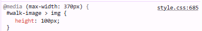
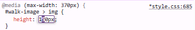
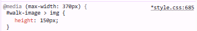

The image with the correct height so none of the picture is cut off (150px)

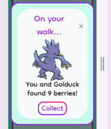

Once I have found the right height in devtools then I can change it in my code and save

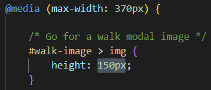

**New Issue**
I then had issues with the width being cut off as the height is too much, so at some screen sizes, only in the collection, when the screen was larger and I had 3 pokemon side by side, some of the larger images were cropped at the sides, and then others were cropped at the top if the height wasn't enough.

I fixed this by changing `object-fit: cover;` to `object-fit: contain;`, which means that none of the image will be cropped off at all, but I left the starter and modal images as `cover`, as the modals will be given more space, as only 1 image will be shown in a modal at one time, and I left the starters, as there are only ever going to be 3 images for those, not randomised from 151 sprites, so I have already tested that they will never crop any of the images at any screen size. -->


<!-- To add shadow to text in css:

    /* left shadow */
    text-shadow: -2px 0 var(--quaternary-colour);
    /* right shadow */
    text-shadow: 2px 0 var(--quaternary-colour);
    /* bottom shadow */
    text-shadow: 0 2px var(--quaternary-colour);
    /* top shadow */
    text-shadow: 0 -2px var(--quaternary-colour); -->