---

# Pokégotchi

View live website [here](https://anerkiki.github.io/pokegotchi-using-pokeapi/) (Hosted on GitHub pages)

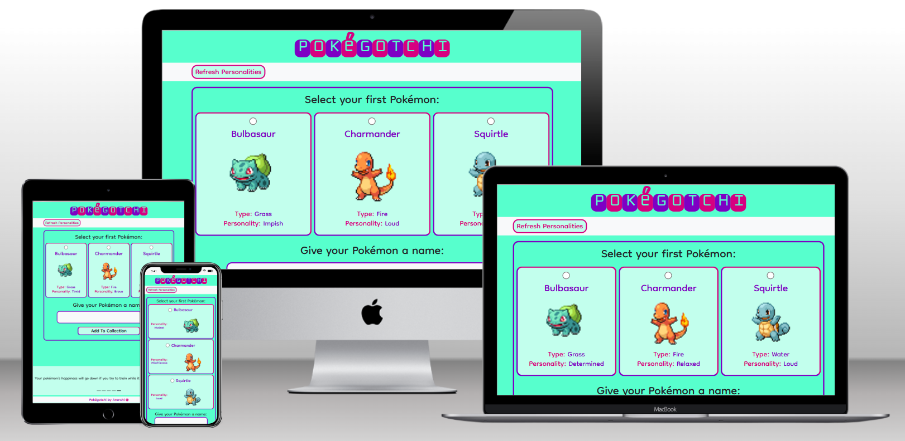

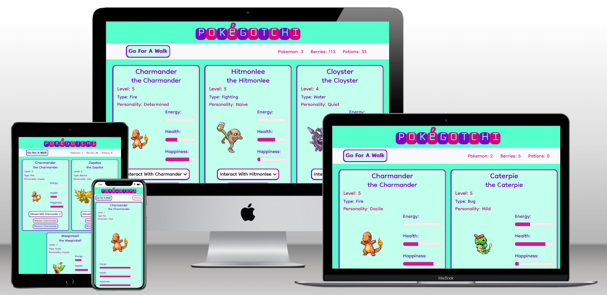

---

# Table of Contents

---

- [Planning](#planning)
  - [Objectives](#objectives)
  - [User Experience/User Interface (UX/UI)](#user-experienceuser-interface-uxui)
    - [User Stories](#user-stories)
  - [Wireframes](#wireframes)
    - [Changes I made](#changes-i-made)
    - [Starter Selection Wireframe](#starter-selection-wireframe)
    - [User Collection Wireframe](#user-collection-wireframe)

- [Design](#design)
  - [Typography/Fonts](#typographyfonts)
  - [Colour Scheme](#colour-scheme)
    - [Font Colouring](#font-colouring)
    - [Colour Palette](#colour-palette)
  - [Favicon](#favicon)

- [Features](#features)
  - [Site Wide Features](#site-wide-features)
    - [Title and Navbar](#title-and-navbar)
    - [Footer](#footer)
    - [Modals/Pop Up Boxes](#modalspop-up-boxes)
    - [Keyboard Shortcuts](#keyboard-shortcuts)
  - [Starter Selection Page](#starter-selection-page)
  - [User Collection Page](#user-collection-page)
    - [Navbar - Go For A Walk Button](#navbar---go-for-a-walk-button)
      - [Finding Items](#finding-items)
      - [Encountering New Pokémon](#encountering-new-pokémon)
    - [Navbar - Inventory Display](#navbar---inventory-display)
    - [Pokémon Profile - Title showing Nickname and Species](#pokémon-profile---title-showing-nickname-and-species)
    - [Pokémon Profile - Smaller Details](#pokémon-profile---smaller-details)
      - [Level](#--level)
      - [Type](#--type)
      - [Personality](#--personality)
    - [Pokémon Profile - Image](#pokémon-profile---image)
    - [Pokémon Profile - Status Bars](#pokémon-profile---status-bars)
    - [Pokémon Profile - Interact Button](#pokémon-profile---interact-button)
      - [Train With](#--train-with)
      - [Feed Berry](#--feed-berry)
      - [Feed Potion](#--feed-potion)
      - [Play With](#--play-with)
    - [Pokémon Profile - Release Button](#pokémon-profile---release-button)
    - [Pokémon Profile - Rename Button](#pokémon-profile---rename-button)

- [Testing](#testing)
  - [W3C Markup/HTML Validation Service](#w3c-markuphtml-validation-service)
  - [W3C CSS Validation Service](#w3c-css-validation-service)
  - [Lighthouse Performance](#lighthouse-performance)
  - [Accessible Web Test](#accessible-web-test)
  - [WAVE Test](#wave-test)
  - [WebAIM Contrast Checker Test](#webaim-contrast-checker-test)
  - [Manual Testing](#manual-testing)
    - [How I achieved my User Stories](#how-i-achieved-my-user-stories)
    - [Table to test modalIsOpen variable status](#table-to-test-modalisopen-variable-status)
  - [Resolved Issues](#resolved-issues)
  - [Other Resolved Issues](#other-resolved-issues)
  - [Other Completed Steps](#other-completed-steps)

- [Deployment](#deployment)

- [Credits](#credits)
  - [Technologies Used](#technologies-used)
  - [Images Used](#images-used)
  - [Acknowledgements](#acknowledgements)

- [Other](#other)
  - [Possible Future Additions](#possible-future-additions)

---

# Planning

## Objectives

I decided to make a game that I would myself enjoy playing, and I have always loved the idea of collecting pets, which has fed into my love of pokémon, as that is the general idea of their game. I also like the idea of tamagotchi (despite never owning one) - which is a virtual pet that you can interact with, which was a craze when I was younger, and I thought it would be a fun idea to merge the two, to make Pokégotchi!

I already knew of a free to use pokémon API called [PokéAPI](https://pokeapi.co/), which includes every pokémon species, type, pokédex number and even various image sprites for each pokémon, so thought this would be the perfect API to use and incorporate into my project, as I can pull individual data linked to each pokémon from there to use.

The main objectives of the Pokégotchi website are:

- **Simple and easy to use:** I want this game to be easy to use and navigate, whether you have played a similar game before or not.
- **Bonding with your pokémon:** By choosing nicknames and personalities for the pokémon, the user will be more likely to grow attached and feel more connected to the game.
- **Cute and appealing:** I want this game to appeal to younger users or people who like similar cute collection games.
- **An easy way to fill free time:** Keeping the mind occupied while waiting in a queue or for an appointment.

These objectives should guide the design, content, and functionality of the website to deliver an enjoyable and fun user experience.

---

## User Experience/User Interface (UX/UI)

### User Stories

- As a user I want to adopt a pokémon that feels like it's really mine.
- As a user I want to increase the Energy, Health and Happiness status bars on my pokémon.
- As a user I want to increase the level of my pokémon so that I can find and catch more & different pokémon.

I have explained how each of these have been achieved in the [How I achieved my User Stories](#how-i-achieved-my-user-stories) in my [Manual Testing](#manual-testing) section of this README.

**These are also some potential users of the website:**

- **As a millennial that grew up with pokémon/tamagotchi:**
  - I want to invoke a sense of nostalgia that will bring happiness from playing a game, featuring characters I recognise.

- **As a mother:**
  - I want to find a game that my kids can play that is simple yet appeals to them and is engaging enough to keep them busy.

- **As a hospital patient:**
  - I want to find a game to occupy my mind while waiting for appointments/confined to a bed.

- **As a retiree:**
  - I would like a game where I can feel a sense of warmth and connection, like having a virtual pet to interact with to reduce loneliness.

---

## Wireframes

#### Changes I made

I did plan to have a few separate pages at first, which included a Shop/Shelter, but for simplicity, and after realising I would need to use local storage to save the inventory/pokémon lists, I decided to stick to having just the 1 page, and have various pop up modals which can make changes to the page, i.e. adding a new pokémon or items to the user's collection or inventory.

So because of this change, I decided to remove the `Home` and `Shop` navigation from the navbar and use it only to display the `Inventory` items and buttons. I chose to have important buttons that I didn't want the user to miss in the navbar too, and changed the order, so that any buttons were on the left, and the less important `Inventory` was on the right, as it can't be interacted with. I also removed the `Coins` option from the navbar `Inventory` list and chose to stick to only `Pokémon`, `Berries`, and `Potions`.

I also added a footer, with a tip carousel and copyright information.

### Starter Selection Wireframe

| Starter Selection Page on larger screens (laptops & larger): | Starter Selection Page on smaller screens (mobile & tablet): |
| :---: | :---: |
|  |  |

**Starter Selection Page - Changes I made**

I changed the layout slightly so that the radio selector was at the top, above the pokémon name, and details like the type and personality were under the image. I removed `Level` entirely, as I set all starter pokémon to start at level 1, so it is unnecessary at this point, and I wanted the starter description boxes to be as small as possible so that the rest of the form steps were more visible.

I chose to also drop the `Type` option from each of the starter pokémon when on a smaller screen, as the options then stack, so I wanted to make them less tall still, so it is clear for mobile users etc. that there are more options below the first one, instead of each option taking up a large portion of, or all of the screen.

I chose to add a `Refresh Personalities` button to the navbar to give the user more control of their chosen starter.

### User Collection Wireframe

| User Collection Page on larger screens (laptops & larger): | User Collection Page on smaller screens (mobile & tablet): |
| :---: | :---: |
| 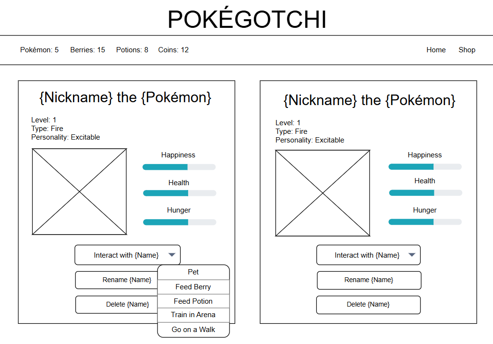 | 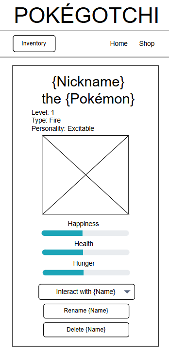 |

**User Collection Page - Changes I made**

I chose to remove the speech bubble tips from inside each of the pokémon profile boxes and instead have a carousel of tips along the footer to help advise the user with the next steps to take.

I reordered the status bars and `Interact` button options so they matched in order, making sure the `Train With` option was at the top as this is the option that will be needed first to progress in the game to get to unlock more pokémon encounters. I also added descriptions of which interaction affects which status bar so it is very clear to the user how to manipulate each status bar, and leaves no room for guessing.

I changed the option `Pet` to `Play With` as it looks nicer and is the same amount of words as other actions (eg. `Train With`, `Feed Berry`) so also looks neater and more aligned.

I changed the `Hunger` to `Energy` as having the hunger bar which increases when a pokémon is fed didn't make sense and I wanted every status bar to increase when actions are made like feeding a berry or potion.

I also changed the order of the `Rename` and `Delete` buttons so the colour would alternate, as I felt pink suited the options that are normally red, like delete or cancel, which I tried to stick with in all my button colouring throughout the game, including in my modals.

I also changed `Delete` to `Release` so the game is more child friendly and it won't feel like their pokémon will be gone forever, only released to live happily somewhere else.

**Interact Button Options**

I also included a small key I made to include ideas for what would happen when each button option was pressed.


**Interact Button options - Changes I made**

I changed the `Train` option to increase the level by 1, instead of 0.5, so the levels stay as integers and it is easier for users to get to level 5 immediately before having to use the `Go For A Walk` option.

I moved the `Go For A Walk` button to the navbar instead of in the `Interact` menu, as this is a key component in playing the game and I felt it was too hidden inside a dropdown button and should be visible and clear always when in the User Collection stage.

The button also doesn't affect happiness, and only gives inventory items such as berries/potions, or a pokémon encounter chance.

**Modals**

A big part of the game journey will be through pop up modals, so I made a wireframe for what the modal would look like too. The background has been greyed out.

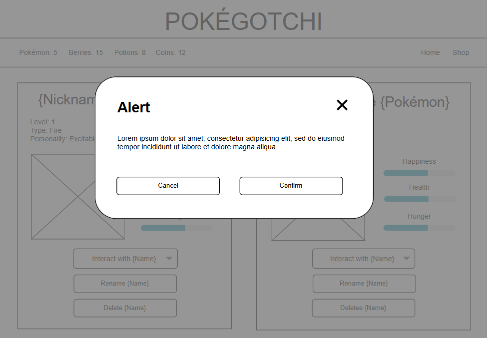

---

# Design

## Typography/Fonts

I wanted to pick a heading which felt similar to the style of 'Tamagotchi', so I used `Google Fonts` to explore options. Using their preview tool, I tested the phrase "Pokégotchi" (which will be shown at the top of the page) to ensure it looked just right, especially the `é` character, which appeared odd in some fonts. I ultimately chose `Monofett` because I felt like it looked very similar to the round look of a physical tamagotchi and almost felt like it was designed specifically for a project like this.

For the main font, I wanted a simple, clear, and unfussy font that would be easy to read but still look youthful and fun. Again using `Google Fonts`, I browsed sans-serif options, this time testing with the male and female symbols as I know some of the pokémon will have them in the name, so the font I chose needed to support these, and a few of Google fonts don't support some symbols. From the ones where the symbols looked good and aligned well with the text, I selected `Dongle` as the best suited for this website's needs.

| Header Font | Paragraph Font |
| :---: | :---: |
|  |  |

I did notice with my paragraph font `Dongle`, that the line height was larger than looked good when the text was on 2 or more lines. I amended the line-height to `1`/`0.8` in a few different places, which fixed this.

| Without line-height adjustment | With line-height adjustment |
| :---: | :---: |
|  |  |

## Colour Scheme

I researched Tamagotchi and found that the colours they used were teal, purple and pink, so decided to use similar colours for my design.

To be able to use each of these specific colours within my project, I used [ColorZilla](https://www.colorzilla.com/), which is a Chrome extension that allows you to select specific colours from a webpage using a dropper tool, to find the specific hex code/RGB code from a Tamagotchi website, then slightly adjusted the colours, making them slightly calmer, ensuring they still complemented each other, so that it would give a more calming atmosphere to the page and appeal to a wider range of users.

I liked Bootstrap's preset navbar colour (slightly off white), so chose to use that in my palette too. I also included black for some of the parts I wanted to make stand out more than the rest, like the text explaining which steps to take next.

For some parts of the website, I wanted to have a muted, paler version of 2 of the colours I had chosen to be in the colour palette.
- Firstly, a pale teal for the backgrounds of the sections that would have writing in, like the buttons and pokémon profiles (so it was pale enough to still work contrast wise with pink and purple text)
- Secondly, I wanted a paler pink for the inventory button/counts and status bar values, as this is less important, and isn't an option the user can interact with so I wanted it to not stand out as much, and as will be shown against a nearly white background, so a paler pink would work there, and still be able to pass the contrast tests. I also used this colour for the progress bar values, as they didn't look right with the brightest pink colouring so the muted pink worked perfectly here too.

To get these paler colours, I used the RGBA value of the navbar colour and overlaid the colour over the teal and pink colours I had chosen
using the RGB value from [ColorZilla](https://www.colorzilla.com/) and adding A so I could also adjust the opacity, e.g. `rgba(248, 249, 250, 0.5)` - This shows the colour at 50% opacity.
After testing which opacities looked good by manually testing the colours in the places they would be used, and finding the one that looked best, I used [ColorZilla](https://www.colorzilla.com/) again to just add the hexcode of that colour to my palette, which I used for individual pokémon profile backgrounds/buttons etc., testing that the coloured text still passed the [WebAIM Contrast Checker Test](#webaim-contrast-checker-test).

### Font Colouring

I chose the purple and pink from the colour palette, and black for the font colourings for the website.

I made the black font colour for sections of the website that I wanted to stand out to the user, for example, the text in the starter form instructing the user to select their first pokémon, name their pokémon, and on the 'Add To Collection' button.

I also chose to have the tips in the footer carousel black too, so they would stand out as they are handy to the user for information about how to proceed with the game.

I chose to have the colours for the buttons alternating purple and pink, with the cancel/release buttons being pink rather than purple, as this is closer to the usual red cancel button colour, but ties into the website colour perfectly. I think this is achieved nicely.

I decided to alternate the pink and purple colours for my page title using `span` tags:

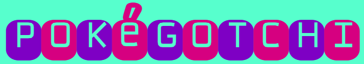

The inventory button and inventory item count I had in a paler pink, as these can't be interacted with, and are only there to inform the user about the items they have stocked, and I wanted to ensure the Go For A Walk button stood out the most in the navbar. I have only used this paler pink colour in the navbar for the inventory items, as it has a consistently near white background, so the contrast will be enough, and in other places (e.g. the pink release button), the background isn't as light, so the darker pink colour is used.

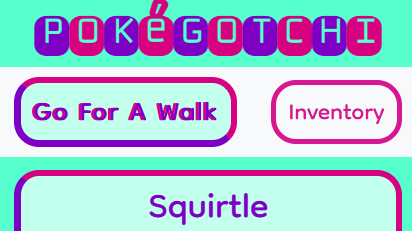

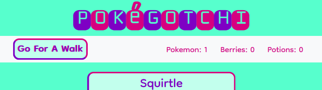

### Colour Palette


|  |  |
| :--- | :---: |
| For future maintainability, I defined each colour as a CSS variable, for example: `var(--colour-name)`. | This approach made it easy to update the palette later if needed - changing a single variable would update the colour everywhere it was used. |
| 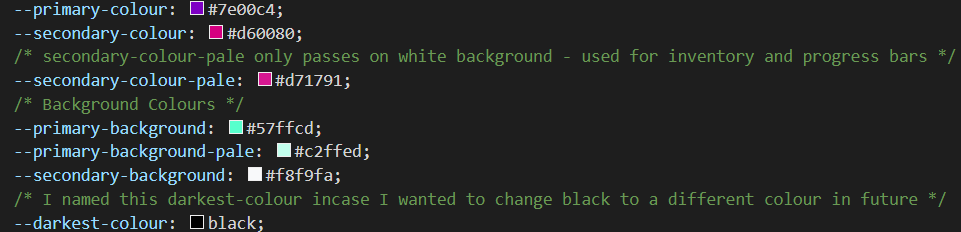 | I used ordinal prefixes to name the variables, (e.g. Primary, Secondary, Tertiary) and added background to the colours that would only be used as backgrounds so the names didn't end up too abstract. |

## Favicon

I chose a simple pokéball favicon, also from PokéAPI which is 30px x 30px, so the perfect size for a favicon.


---

# Features

## Site Wide Features

### Title and Navbar

The title of the website is shown on every page, and just below that is a navbar, which has different buttons depending on the user's stage in the journey. I will explain these further below.

### Footer

In the footer, I have added a tip carousel, featuring 5 tips to help the user use the website and progress their game/collection.
These slide to the left, being replaced by the next tip, and once through all the tips, it continues again from the start.

I wanted to add this feature to help users that had become stuck or weren't sure what to do next, and I also have suggestions in the various pop ups to advise the next steps, and how to add more pokémon to grow their collections, e.g. 'If your pokémon is over level 5, there is a chance of encountering wild pokémon on walks with them!'

These help clarify the purpose of the game and ensure the next steps they should take are always clear to the user.

Below the tip carousel, I have added some copyright information.

| Smaller Screen Footer: | Larger Screen Footer: |
| :---: | :---: |
|  |  |
|  |  |

I used a photo carousel from Bootstrap and adjusted it to be able to work with text instead, and amended a few other parts of it to work for this project.

I also adjusted each tip's location within the carousel area, so if it is on a large screen where there is only 1 row of text, the tip is nicely centralised with an even gap above and below etc. I did this using `br` tags which appeared or disappeared depending on the screen size.

I adjusted the time each tip stayed on the screen for using Bootstrap's intervals which are part of their carousels, also shown below. I adjusted the times for each of the tips in the carousel dependant on how long the text in the tip was and asked friends and family to check if it was long enough for them to read, and then chose those times.

```html
<div class="carousel-item" data-bs-interval="3000">
    <p><br class="d-none d-sm-block">Train with your pokémon to increase their level!</p>
</div>
<div class="carousel-item" data-bs-interval="3500">
    <p><br class="d-none d-lg-block">If your pokémon is over level 5, there is a chance of encountering
        wild pokémon on walks with them!</p>
</div>
```

I ensured that the height was always consistent, regardless of how many lines of text there were in a tip by setting a min-height.

```css
.carousel-item p {
    /* adjusted so height doesn't change on different screen sizes when there are more rows of text */
    min-height: 8rem;
    text-wrap: balance;
}
```

---

### Modals/Pop Up Boxes

I used a lot of pop up modals which were inspired from the old pokémon style games, where pop ups used to take you to different areas or parts of the story/journey.

As I decided to stick with having just 1 page, I decided having different modals could be a fun way to add some excitement and progress in the game.

I took a few modal 'shells' in HTML from Bootstrap, and then used JavaScript to edit the content. Where the layout and purpose of the modal was different, I used a different modal to keep things clearer, but for modals where only the text changed, I reused the same modal, for example, my `alertModal` was used for when a pokémon hasn't been selected on the Starter Selection page, and also if the user is trying to use items they don't have in their inventory.

Some of the modals lead to other modals, so I made slightly different classes for the 'continuing' buttons, which opened another modal, so that the key interactions and the variable tracking if a modal is open both still worked seamlessly.

I have explained these issues more thoroughly and how I fixed them in my [Resolved Issues](#resolved-issues) section.

### Keyboard Shortcuts

I added a JavaScript function so that the `ENTER` and `ESC` keys will work with modal buttons so they can be pressed without the mouse. The `TAB` key also cycles through the options well, so accessibility in all modals is very good.

## Starter Selection Page


- Shows a form with starter options at initial page load, or when user deletes their last pokémon from their collection.

**Featuring:**
- In the Navbar -
  - 'Refresh Personalities' button
- Main Section (Starter Selection Form) -
  - 3 starter options - each featuring name, image, type (on larger screen sizes) and randomised personality
  - Nickname input box
  - 'Add To Collection' button

When you first open the website, there is a form shown with 3 starter pokémon choices for the user to choose from.
There is also a button to refresh the personalities of the starter pokémon at the top of the page within the navbar.

Inside the form, the steps to follow to select a pokémon are in black font, so it stands out clearly against the other writing and buttons, which are in pink or purple fonts.

The first step is to `Select your first Pokémon:`, and just below this text are 3 starter options which feature an image sprite, the name beneath/beside a radio selection button, the pokémon's type, and a randomised personality picked from an array of 24.
The images are pulled from an API, however, as the names and types of these pokémon are always the same for the first 3 choices, I just typed the type/names into my HTML instead of fetching these as well, to save time on the page load.

The refresh personalities button changes the personality inside these options when clicked, and will still work to change the personality even if a pokémon has been selected.

Once a pokémon selection has been clicked, the styling of the option 'box' changes from a pink and purple border with pale aqua background to a black border and white background so it is clear this step has been completed.

Below is the next step: `Give your Pokémon a name:`, with a text box below to input a name. This is an optional step, and if the text box is left blank, the nickname will default to the pokémon's species name, e.g. 'Bulbasaur the Bulbasaur'. I have set the cursor to start in this box as soon as the page loads so writing a nickname is easier. I have set any words written in here to automatically capitalise the first letter, and also it has a character limit of 12, which I explain in the [Rename Button](#pokémon-profile---rename-button) section.

The final step is to click the `Add To Collection` button, so this has black text too to make sure it stands out to the user, as with the other steps.

| Small Mobile: | Large Mobile: | Tablet: |
| :---: | :---: | :---: |
|  |  |  |

**Laptop:**


*Note: The tips are only showing as not centralised because I took the screenshot while they were moving, when they stop, they are central.*

Once the first pokémon has been chosen and the submit button has been pressed, I changed the visibility of the form and 'Refresh Personalities' button to hidden and show the user's pokémon collection instead and different buttons appear in the navbar instead (explained below).

This is all done using a function in JavaScript which is triggered by the form submit button being clicked.

There is also a pop up that appears if no pokémon have been selected and the button is pressed, letting the user know that they need to choose one of the 3 starters before they can continue.

| Pokémon not selected error (small screen): | Pokémon not selected error (large screen): |
| :---: | :---: |
|  |  |

## User Collection Page


Once the user has 1 or more pokémon added to their collection, I have set the starter option form and refresh personality button to disappear, a 'Go For A Walk' button becomes visible in the navbar instead, along with the user Inventory, and the new chosen pokémon's profile will now be displayed in the centre of the page.
This has details like its Level, which starts at 1, and 3 status bars showing 'Energy', 'Health' and 'Happiness' along with 3 buttons, Interact With, Release and Rename. The pokémon's nickname has been dynamically added to these buttons so whatever the user has chosen the nickname to be is part of the button name, e.g. 'Interact with Bob'.

**Featuring:**

- In the Navbar -
  - 'Go For A Walk' button
  - Inventory count (changes to a button on smaller screens)
- Main Section (Individual Pokémon Profiles) -
  - A Title showing Nickname and Species
  - Smaller details
    - Level
    - Type
    - Personality
  - Image
  - 3 Status Bars
    - Energy
    - Health
    - Happiness
  - 'Interact with' button which opens to show options:
    - Train with
    - Feed Berry
    - Feed Potion
    - Play With
  - 'Release' button
  - 'Rename' button

### Navbar - Go For A Walk Button

There is also a new 'Go For A Walk' button which appears in the navbar beside the inventory expandable button/amounts once there are 1 or more pokémon in the user's collection.

When you click the walk button, a modal pops up and describes details of going for a walk. One pokémon from the user's collection is chosen randomly to accompany the user on the walk.

There are 2 outcomes from going for a walk:
- Finding Items
- Encountering New Pokémon

#### Finding Items

For this option, the accompanying pokémon's nickname is shown in the walk description, along with a backwards image of the pokémon, to look as if it is walking ahead of the user.

A random amount of berries (between 2 and 10), and a random amount of potions (between 2 and 5) are generated. If the berry count is under 5, the user will find the generated number of potions as well as the berries. However if the berry count is 5 or more, then the user and their pokémon will only find berries.

I did this because I wanted to make the chance of finding potions less, so they increased in rarity.

Once the pop up has come up, there are 2 options, however I chose to only have 1 button (Collect) shown at the bottom of the modal, to encourage the user to keep any items and have them added to their inventory.

Once the Collect button has been pressed, any items that were found on the walk are now shown in the inventory and can be used to interact with any of the user's pokémon using the [Pokémon Profile - Interact Button](#pokémon-profile---interact-button).

The second option is to select the `x` in the top corner to close the modal, which just exits the modals without adding anything to the inventory or making any changes. I have these in all of my modals for consistency.

#### Encountering New Pokémon

Once the pokémon the user is walking with has reached level 5, there is a chance to encounter a new pokémon. The chance is 20% if the pokémon the user is walking with is level 5, and 0% if it is under level 5. If the user has 2 pokémon and only 1 is 5 or above, there will only be a chance of an encounter when walking with that specific pokémon.

When this encounter happens, instead of the walk results pop up, an alert pop up appears saying `"You hear a rustling coming from the long grass."` with a button below with the text `"Investigate"`. There is also an `x` in the top corner to close the modal, which just exits the modals without adding or continuing the encounter.

I did debate adding another message for water pokémon encounters, but I felt "the long grass" covered it fine, as there could be ponds, lakes or marshes in long grass, and having a description like this makes it feel like more of an adventure. In future I could add other options and have it randomly select one each time.

If the user selects "Investigate", this will trigger another pop up, randomly selecting a pokémon from the first 151 pokémon from PokéAPI, and fetching their image, name and type, and also randomly generating a personality for them from my array of 24 personalities and a level between 1 and 5.

Sometimes if the internet was running slow, the image etc would take a while to load and the user was left with a blank screen, so I added a text option to show first, while the image and name were being fetched from PokéAPI.

The buttons at the bottom give 2 options: `Run Away` or `Adopt`. If the user chooses to run away, nothing happens and no pokémon is added. However if they choose to adopt, a new modal appears with the option to give the new pokémon a nickname. If no nickname is chosen, i.e. the input box is left blank, or the `x` in the corner is selected, the nickname will default to the pokémon's species name, as it does for selecting a starter pokémon. This pokémon is now added to the user's collection and is ready to interact with.

I randomised the personality of the new pokémon to be one of the 24 options, set the level to randomise between 1 and 5, set the energy bar to 40/100, health bar to 80/100 and happiness bar to 10/100.

I decided to make the Happiness low as it hasn't been interacted before so might be lonely, and this also encourages the user to use the `Play With` interaction and feel like they have grown a bond with their new pokémon.

|  |  |
| --- | :---: |
| Loading encounter modal | Encounter modal once image has been fetched |
| 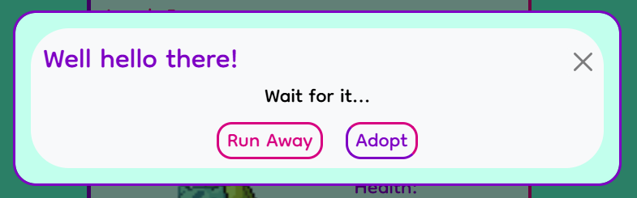 | 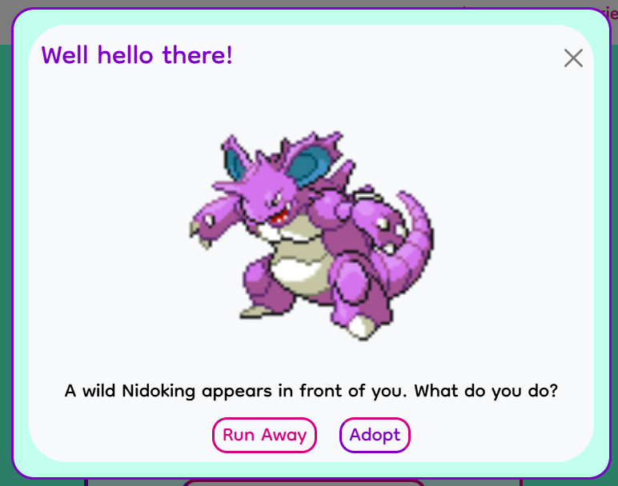 |

### Navbar - Inventory Display

I decided to display the Inventory amounts at the top of the page, inside the navbar, similar to a navbar menu, which changes to a button menu on smaller screens. These aren't interactable, but the amounts will change throughout the game as more pokémon/berries etc are collected, and will reduce if berries/potions are used, or pokémon are released.

|  |  |
| --- | :---: |
| Inventory Button | Inventory Button expanded |
| 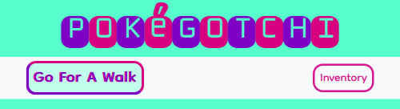 | 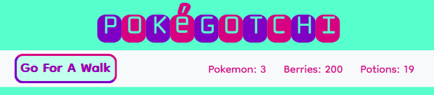 |

### Pokémon Profile - Title showing Nickname and Species

I wanted the Pokémon's nickname to stand out more than the species description (e.g. "the Charmander"), so I set the nickname to 110% of the remaining title's font size. I used `em`, which scales relative to the parent element, and applied it only to the `pokemon-nickname` class, while the rest of the text remains inside the `h2`. Since the `h2` font size changes at different screen sizes through media queries, using `em` ensures the nickname always stays slightly larger (110%) regardless of the overall heading size.

```html
<h2><span class="pokemon-nickname">${capitaliseWords(pokemon.nickname)}</span>the ${capitaliseWords(pokemon.name)}</h2>
```

### Pokémon Profile - Smaller Details

Below the title to the left side are some smaller details which include:

#### - Level

This increases by 1 every time the user clicks the `Train With` option from the `Interact With` dropdown button. A pokémon needs to reach level 5 to be able to encounter new pokémon while on walks.

#### - Type

This shows the 1st type of each pokémon, which is pulled from the individual pokémon details on PokéAPI using a fetch request, and then added to the user's pokémon collection details.

This only displays on larger screens, as on smaller screens there is less space to display the pokémon profiles next to each other, so I have tried to make the stacked profiles as short as possible so that it is still easy to scroll down and see the basic details of each pokémon in the user's collection.

#### - Personality

This is chosen randomly for each pokémon from a collection of 24. There is an option to reshuffle the personalities using a button while the starter selection form is visible, but for encountering wild pokémon on walks, the personality is randomly chosen when they are encountered. The personality can't be changed once the pokémon has been added to the collection.

The personalities currently don't do anything else, but are a cute addition, and can make the user feel more connected to their pokémon.
In future I could make personalities influence how much a status bar increases or decreases, or the likelihood of a pokémon joining for walks.

### Pokémon Profile - Image

The image, like the type and species name in the title are fetched from the specific pokémon details in PokéAPI.

This is a link to one of the images from PokéAPI that is fetched and used within the website:
`https://raw.githubusercontent.com/PokeAPI/sprites/master/sprites/pokemon/1.png`

### Pokémon Profile - Status Bars

I decided upon 3 status bars: `Energy`, `Health` and `Happiness`, which can be manipulated using the `Interact with` dropdown button options, these are explained in detail in the [Pokémon Profile - Interact Button](#pokémon-profile---interact-button) section below. Each status bar shows the current amount out of 100.

Depending on the size of the pokémon profile box, the status bars can have even gaps, to ensure the bars look neat at all screen sizes, shown below:

| Status bars with no gaps | Status bars with even gaps |
| :---: | :---: |
|  |  |

### Pokémon Profile - Interact Button

The interact button is clearly larger, with a bigger border, which I coloured a mix of pink and purple, black text and a white background. The text has an arrow beside the text to show the user that this button has a dropdown menu. This arrow changes colour to pink and purple when the button is hovered over with the mouse.

From these menu options the user can manipulate the status bars, and sometimes the level and inventory.
I added an explanation to the end of the button options as to which status etc. is affected so that it is clearer to the user.

There are 4 options:

#### - Train With

This option increases a pokémon's `Level` by `1`, and decreases 2 of the status bars: `Energy` by `10` and `Health` by `20`.
If the pokémon's `Health` or `Energy` are already lower than 20 out of the possible 100, and the user tries to use the `Train With` option, the pokémon's `Happiness` will drop by `10` and a modal will pop up explaining that they are too hungry or need to heal before they can train anymore.
I have also added a pop up to let users know when their pokémon has reached level 5 that they are now able to encounter wild pokémon while on walks with them.

#### - Feed Berry

This option increases a pokémon's `Energy` status bar by `15`, and its `Happiness` by `5`, and removes one of the berries from the user's inventory. Once the bar is full, if a user tries to feed it another berry, an alert will pop up to tell the user the pokémon is now full.

#### - Feed Potion

This option increases a pokémon's `Health` status bar by `15`, and removes one of the potions from the user's inventory. Once the bar is full, if a user tries to feed it another potion, an alert will pop up to tell the user the pokémon is now at full health.

#### - Play With

This option increases a pokémon's `Happiness` and doesn't use any items from the inventory. There is no pop up to tell the user that the pokémon's happiness is full, as I wanted the users to feel free to play with their pokémon as much as they like, however their `Happiness` bar will still stay at 100 once full no matter how many the user selects `Play With`.

### Pokémon Profile - 'Release' button

Pressing this button will trigger a pop up modal asking if the user is sure they want to release their pokémon, with 2 button options - `Cancel` and `Release`, as well as an `x` in the corner, which works the same as the Cancel button, and can also be triggered by pressing `ESC`.

If you select `Release`, or press the `ENTER` key, the selected pokémon is removed from the user's collection, and the page will either refresh to show all remaining pokémon, or if none are left, the Starter Selection form will reappear, along with the 'Refresh Personalities' button in the navbar, and the 'Go For A Walk' and 'Inventory' will disappear, as it did when the Starter Selection form was shown originally.

### Pokémon Profile - 'Rename' button

This button gives the user the option to change or add a new nickname to any of the pokémon in the collection. When the button is pressed, a pop up modal comes up which asks the user to choose a new nickname for their pokémon, with a text box to type in.

The text box is pre-filled with the current nickname which makes it easier for small edits, and also reminds the user of the current nickname.

Whether the name the user types in starts with a capital letter or not, when the Rename button is pressed, each word of the nickname will automatically have its first letter capitalised.

I implemented a character limit to the nicknames, so that any names given to the pokémon could never expand outside of the pokémon profile box, no matter the screen size.

I googled what the widest character in most fonts is, which is M or W, and in my chosen font, the W was wider, so I tested with this to find the perfect character limit for my nicknames.


---

# Testing

---

## W3C Markup/HTML Validation Service

This is the test result from my W3C HTML Validator Test:


---

## W3C CSS Validation Service

The CSS stylesheet passes the CSS Validation Service.


There were some warnings (only 2 different) which are due to using CSS variables and imported stylesheets from Bootstrap, which aren't anything to worry about.

<details>
<summary>*click to see warning messages*</summary>


</details>

---

## Lighthouse Performance

<!-- *[TO DO: Check with tutor which are needed and choose 1, above or below, and if a score of 81 is okay]* -->

I tested this website using Lighthouse in DevTools and there are my results:

|  |  |
| :---: | :---: |
| Desktop Results: | Mobile Results: |
| 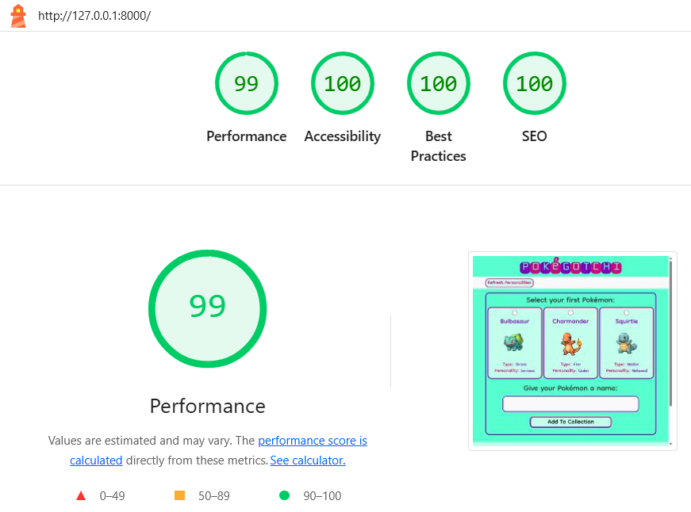 | 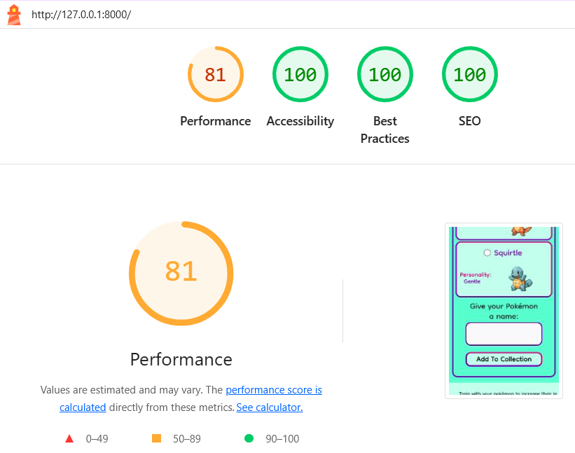 |

<details>
<summary>From deployed website on GitHub Pages:</summary>

|  |  |
| :---: | :---: |
| Desktop Results: | Mobile Results: |
| 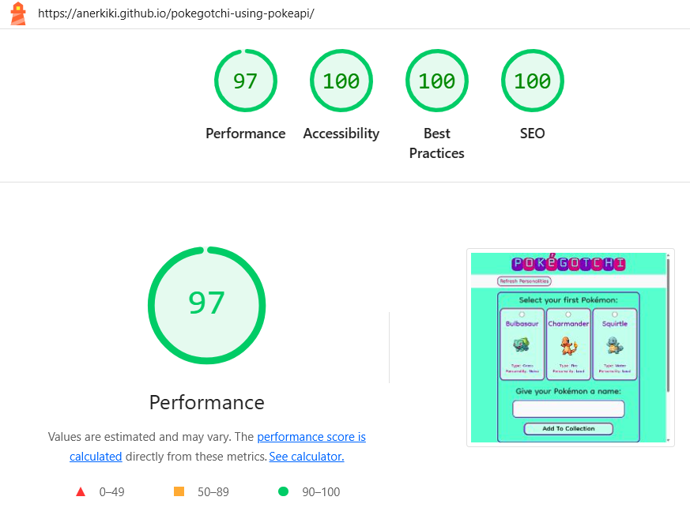 | 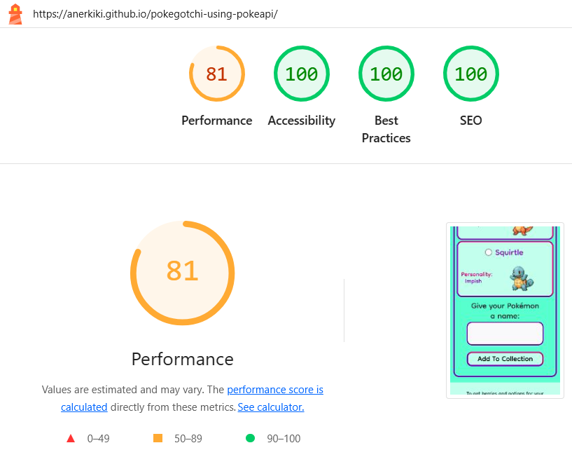 |

</details>

---

## Accessible Web Test

https://accessibleweb.com/website-accessibility-checker/


---

## WAVE Test

After correcting a couple of `alerts`, these were my WAVE test results:

There were **no Errors** or **Contrast Errors**, and **15 Alerts**, which aren't issues that need any corrections.

From running this test, I did manage to change things in my code to remove 2 of the Alerts, so the only remaining Alerts are due to large font being flagged as being a possible heading. However, when checked, it was only picking up things like the Type and Personality details, and the Tips inside the footer, which are all not headings.

The 2 fixed alerts:

I previously had a `Redundant alternative text` alert, which I fixed by removing the alt attribute in my 3 starter choice images, as the name was already set using the label, so removing these removed this alert.

The other alert was a `missing fieldset` alert, and to get rid of this I wrapped the 3 radio starter options in a `<fieldset>`, and change the title to a `legend` instead of a `h2`.

|  |  |  |
| :---: | :---: | :---: |
| Original WAVE test | WAVE test after fixes made | WAVE Contrast Test |
| 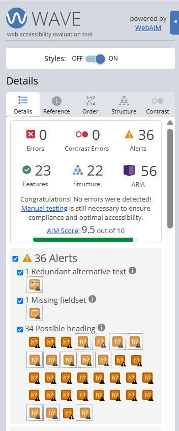 | 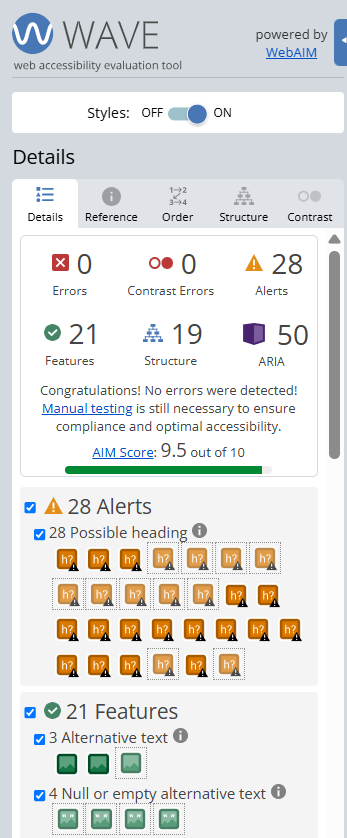 | 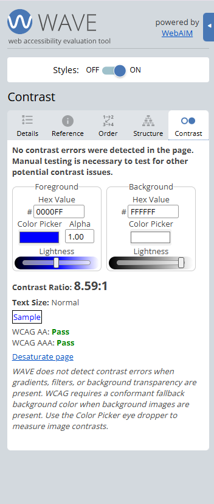 |

---

## WebAIM Contrast Checker Test

There are only 2 background colours which I will have with any text on, which are Icy Aqua and Bright Snow, as shown in the [Colour Palette](#colour-palette).

As shown below, these all pass all of the WebAim contrast checker tests, apart from the secondary colours, but as all fonts in this project are large text, this will still pass all of the AAA tests.

| Colours used for text on the Icy Aqua background |  |  |
| --- | --- | --- |
| Primary Font Colour | Secondary Font Colour | Black |
| 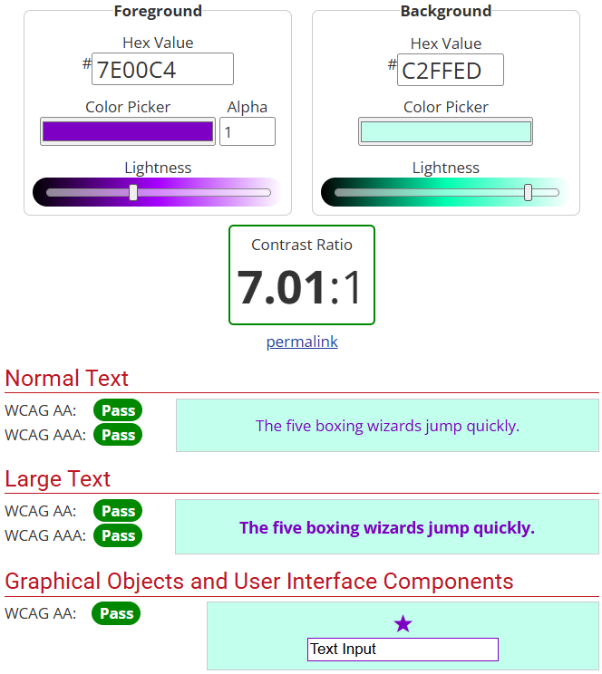 | 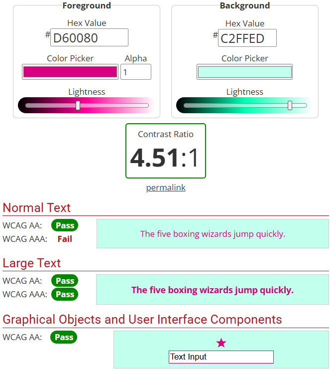 | 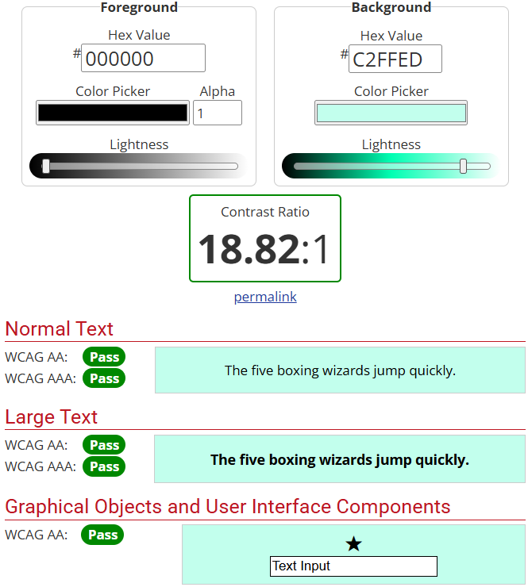 |

| Colours used for text on the Bright Snow background |  |  |
| --- | --- | --- |
| Primary Font Colour | Secondary Font Colour | Secondary Pale Font Colour |
| 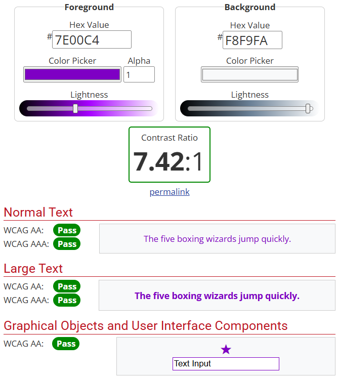 |  | 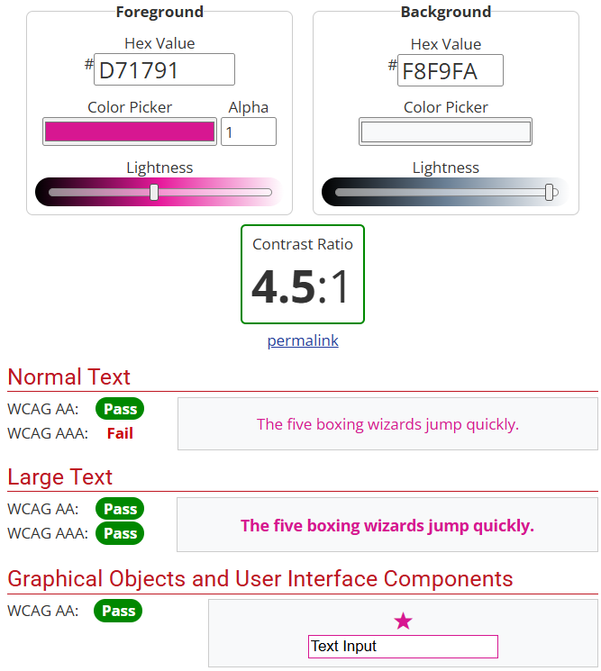 |

*The only other colour which I used on the off white background was black, which had a contrast ratio of 19.92:1.*

---

## Manual Testing

### How I achieved my User Stories

---

**- As a user I want to adopt a pokémon that feels like it's really mine.**

|  |  |
| --- | :---: |
| I have achieved this by having a button to change and customisable personalities, so the user can shuffle them until they find one they like on a starter pokémon they like, and then on top of that they can also choose a personal nickname to make them feel even more like it's "theirs". | 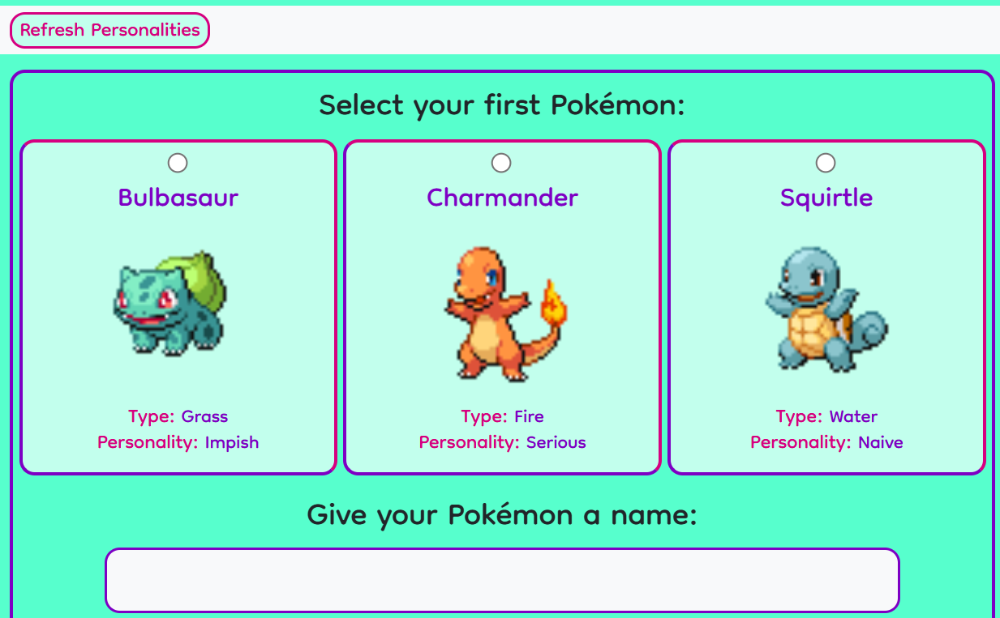 |

---

**- As a user I want to increase the Energy, Health and Happiness status bars on my pokémon.**

|  |  |
| --- | :---: |
| I have achieved this by having actions in my interact button which increase each status bar, and sometimes interacting with several at a time. | 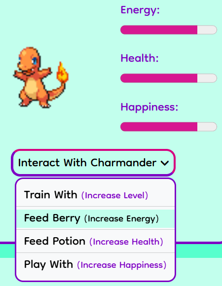 |

---

**- As a user I want to increase the level of my pokémon so that I can find and catch more & different pokémon.**

To level up you can `Train With` your pokémon, so this achieves the first part of the user story, and then once the user has trained enough so that the level is 5 or more, there is automatically a 20% chance of encountering a wild pokémon on a walk, so to achieve the second part, the user can click the `Go For A Walk` button until an encounter takes place, and then select to `Adopt` the pokémon that appears.

|  |  |
| --- | :---: |
| First train with pokémon using the `Train With` interaction option until the level gets to 5 or higher. | 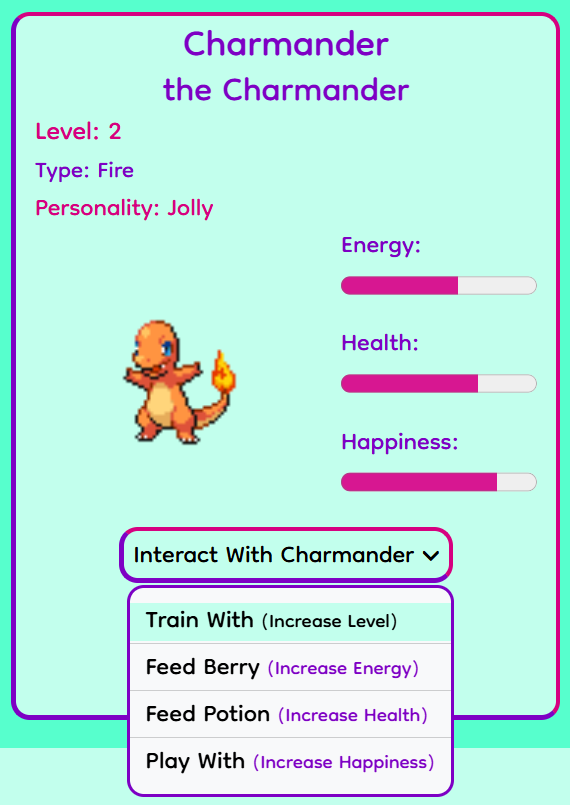 |

|  |  |
| --- | :---: |
| Then a pop up will come up to let the user know that they can now catch wild pokémon on walks. | 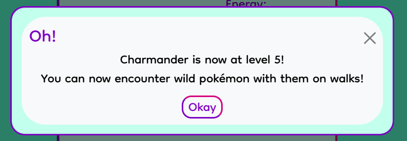 |

|  |  |
| --- | :---: |
| Then the user can click on the `Go For A Walk` option, until the Investigate option comes up. | 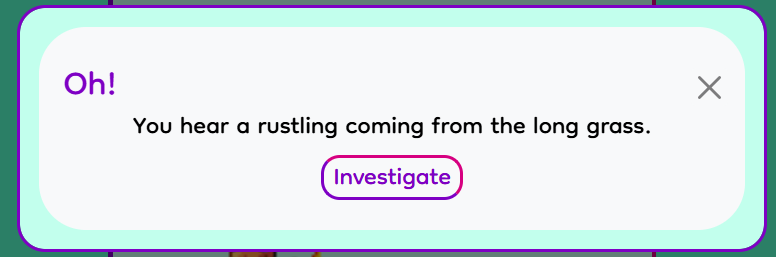 |

|  |  |
| --- | :---: |
| Then if they click through the options to get to the `Adopt` button and press it, they will have added a new pokémon to their collection. | 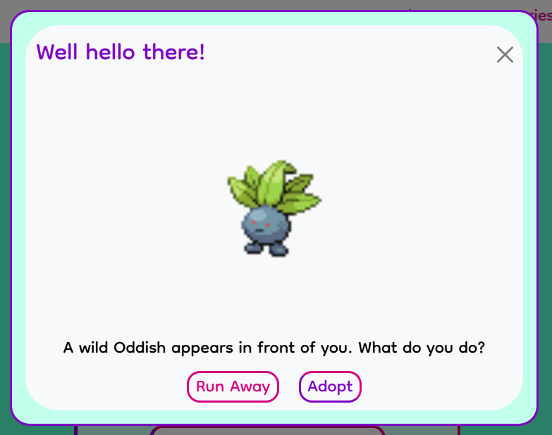 |

|  |  |
| --- | :---: |
| The user's collection now, showing the new pokémon. | 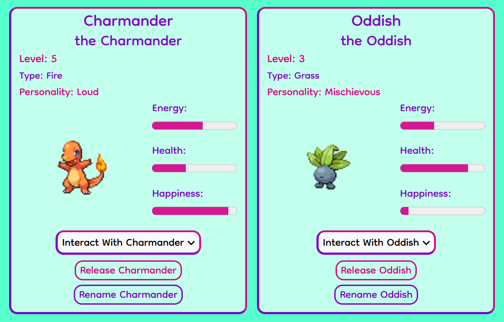 |

---

### Table to test modalIsOpen variable status

I made a table whilst testing, which looked similar to this example below, to narrow down which button options I needed to work on.

| Modal Name | Action | `modalIsOpen` state | Works as Intended |
| --- | --- | --- | --- |
| `releaseModal` | Release | false | Yes |
| `releaseModal` | Cancel/x | true | No |
| `releaseModal` | Click off modal | true | No |
| `renameModal` | Rename | false | Yes |
| `renameModal` | Cancel/x | true | No |
| `renameModal` | Click off modal | true | No |

*Note: I changed all modals to static after creating this table, so the `click off modal` actions are now irrelevant.*

---

| Test Area | What I'm Testing | Did it Pass? |
| --- | --- |:---:|
| Starter Options Page | Does the `Refresh Personalities` button change the personality for all 3 starter options? | Yes |
| Starter Options Page | If no pokémon has been selected and the `Add To Collection` button is pressed, does an alert pop up to tell the user they need to select a pokémon? | Yes |
| Starter Options Page | When a starter option is clicked anywhere inside the border, does the background colouring and border change and is the relevant radio filled? | Yes |
| Starter Options Page | When a different starter option is clicked after clicking another one, is the background colouring, border and filled radio changed to the newly selected option? | Yes |
| Starter Options Page | When a starter option is chosen and `Add To Collection` is pressed, is the selected pokémon with the correct personality added to the starter collection? | Yes |
| Starter Options Page | When a name is typed into the input box and `Add To Collection` is pressed, is the nickname of the new pokémon the same as the name inputted? | Yes |
| Starter Options Page | When a starter option is chosen and `Add To Collection` is pressed, is the `Refresh Personalities` button and form removed from visibility? | Yes |
| Starter Options Page | When a starter option is chosen and `Add To Collection` is pressed, does the `Go For A Walk` button and `Inventory` appear in the navbar? | Yes |
| Buttons | Does the `Go For A Walk` button open a modal when pressed? | Yes |
| Buttons | Does the `Interact With` button open the dropdown menu when pressed? | Yes |
| Buttons | Does the `Train With` dropdown option increase the Level when pressed? | Yes |
| Buttons | Does the `Train With` dropdown option decrease the relevant status bar amounts when pressed? | Yes |
| Buttons | Does the `Feed Berry` dropdown option decrease the berry amount by 1 when pressed? | Yes |
| Buttons | Does the `Feed Berry` dropdown option increase the relevant status bar amounts when pressed? | Yes |
| Buttons | Does the `Feed Potion` dropdown option decrease the potion amount by 1 when pressed? | Yes |
| Buttons | Does the `Feed Potion` dropdown option increase the relevant status bar amounts when pressed? | Yes |
| Buttons | Does the `Play With` dropdown option increase the relevant status bar amounts when pressed? | Yes |
| Buttons | Does the `Release` button open a modal when pressed? | Yes |
| Buttons | Does the `Rename` button open a modal when pressed? | Yes |
| Modals | Do all the modals close as intended when the `Cancel`/`x` button or `ESC` key is pressed? | Yes |
| Modals | Do all the modals continue as intended when the `Confirm` (or similar) button or `ENTER` key is pressed? | Yes |
| Modals | When the user attempts to feed a berry or potion to their pokémon, but they have none, does a modal pop up to explain this and how to get more? | Yes |
| Modals | When the user presses `Collect` after going for a walk, are all the found berries added to the `Inventory`? | Yes |
| Modals | When the user deletes a pokémon, is this pokémon fully removed from the user's collection and the `Inventory` Pokémon count? | Yes |
| Modals | Once a new nickname has been typed and the Rename button has been pressed has the nickname changed to the new nickname? | Yes |
| Modals | When the user presses `Investigate` whilst on a walk, does a randomly generated pokémon appear, complete with image, name, type and randomised personality? | Yes |
| Modals | If the user selects `Adopt`, is this pokémon added to the user's collection, increasing the `Inventory` Pokémon count and does the image, type and personality match the one shown in the modal? | Yes |
| Responsive Design | Does the Inventory amounts adapt to a button at smaller screen sizes as intended? | Yes |
| Responsive Design | Does the Inventory button open the menu when clicked and close once clicked again? | Yes |

---

## Resolved Issues

| Issue | How I fixed it |
| :--- | :--- |
| When the `Go for a Walk` button is clicked, a modal is triggered, but if this happens too slowly and the user clicks the `Go for a Walk` button again, another modal opening is triggered, resulting in more than 1 modal being open at a time and this can get confusing for the user. | I need to stop the `Go For A Walk` button working whenever any modal is open. I decided to do this by creating a boolean variable which will change from `false` to `true` when modal is open, and then disable the `Go For A Walk` button anytime the variable is set to `true`. |

<details>
<summary>Extra details explaining how I fixed the above issue</summary>

I decided to call the new boolean variable needed `modalIsOpen`, which automatically is set to `false`, but can be changed to `true` within functions that open on button clicks. I kept this variable global so that it can be altered within any function in my code.

```js
let modalIsOpen = false;
```

I then went through my code and changed this variable to `true` within all of my functions at the time a modal is opened.

Existing line of code:
```js
$("#walkResultsModal").modal("show");
```
Line I add below it:
```js
modalIsOpen = true;
```

Then I needed to make sure that the variable is switched back to `false` whenever a modal is closed. I did this in a similar way by searching my code for any lines that close a specific modal, instead of looking `"show"` to open a modal, I searched for where it said `"hide"` to close the modal, and then I added a line similar to the one above, but with `true` changed to `false` instead.

As there were a lot of repeated lines of code I was adding to functions to change the boolean state of `modalIsOpen` so I decided to tidy my code by putting the repeated code into 2 new functions: `updateModalStateToClosed` and `updateModalStateToOpen`. These names depict clearly what these functions do, and keeps my code DRY.

Added functions:
```js
function updateModalStateToClosed () {
    modalIsOpen = false;
}

function updateModalStateToOpen () {
    modalIsOpen = true;
}
```

Inside other functions before:
```js
$("#alertModal").modal("show");
modalIsOpen = true;

$("#releaseModal").modal("hide");
modalIsOpen = false;
```

After:
```js
$("#alertModal").modal("show");
updateModalStateToOpen();

$("#releaseModal").modal("hide");
updateModalStateToClosed();
```

During the previous step, I noticed there were far less lines with `modal.("hide")`, compared to `modal.("show")`, so I added less of this line: `updateModalStateToOpen();`, than I did this line: `updateModalStateToClosed();`.

Because of this, I decided to write up all functions and how they could be opened and closed, and did some manual testing, and added `console.log(modalIsOpen);` to my event listener for any keypress to check the boolean state of the `modalIsOpen` variable at various stages in the game.

This is an example of the [table I used to test modalIsOpen variable status](#table-to-test-modalisopen-variable-status), which shows just a couple of the tests I checked for, although this was done manually in a notepad at the time.

| New Issue discovered during Manual Testing | How I fixed it |
| --- | --- |
| I then discovered that the state of `modalIsOpen` didn't change to `false` as it should when closing alert modals (such as alerts that the pokémon needs a berry). Also, when any modal was closed using the `Cancel`/closing `x` in the corner. | I had previously added a class to buttons that closed/cancelled modals called `cancel-modal-button`, so to fix this issue, I decided to target this class using an event listener, so that when any button with this class is clicked, the function `updateModalStateToClosed` is triggered, turning the `modalIsOpen` state to `false`. The new event listener: `$(".cancel-modal-button").on("click", updateModalStateToClosed);` |
| Another issue I found during testing is if the user clicks outside of the modal (only for modals that aren't static), this closed the modal, but again hasn't triggered the `modalIsOpen` boolean state to be changed back to `false`. <br><br>The modals that this happened with are the `alertModal`, `releaseModal`, `renameModal`, and the `wildRenameModal`. All the other modals are static, so will stay open unless either a button has been clicked to close it/open a new modal, or a key has been pressed to trigger a click, which I have already fixed to change the `modalIsOpen` state above. | I decided to make all my modals static, instead of just some, which fixed the problem, and will also prompt the user to interact with the options as they can't click off the modal anymore. |

</details>

| Final step to fix above issue | How I fixed it |
| :--- | :--- |
| There was one addition needed to fix the issue above once the `modalIsOpen` variable has been created and placed in the right place, as described above. | Once I know this works as intended, I look at fixing the main problem - multiple modals/pop ups being able to be opened at the same time. I did this by adding a check to the start of any functions that can trigger a modal to open, to check if there is already a modal open, and if so, abort. This means there should never be 2 modals open at the same time. The code added for this is shown below: |

```js
// a safeguard to prevent the multiple open modals issue
if (modalIsOpen) {
     return; 
}
```

I also added this safeguard code to the `actionBerry`, `actionPotion` and `actionTrain` functions, as an `alertModal` pops up if the pokémon's health or energy are low, or the user doesn't have any berries or potions.

I didn't add the safeguard code to the `walkDisturbance`, `surpriseEncounter` or `addWildPokemon` (which also trigger modals to be opened) as they are only triggered after/because of the `goForAWalk` function, which the safeguard has already been added to.

---

| Issue | Why? | How I fixed it |
| :--- | :--- | :--- |
| Multiple Modals still being opened when using modals that trigger opening other modals. During testing, when I pressed `ENTER` multiple times to open/skip through modals triggered by the `Go For A Walk` button, sometimes 2 modals would still open at the same time, despite having created the `modalIsOpen` variable which should have disabled the button if a modal is already showing as open. I discovered that the event listener that sets the status of `modalIsOpen` would set the status to `false` every time a modal was closed, although some modals triggered another modal to open straight away, so the status shouldn't be changing at these times. | I had attached the event listener which changes the `modalIsOpen` state to `false` when either of 2 classes attached to buttons were pressed: `cancel-modal-button` and `confirm-modal-button`. If one of the buttons which has the `cancel-modal-button` class is pressed, the modal is fully closed, the state of the `modalIsOpen` variable is correct, and no issues occur. However, the problem lies with the buttons with the `confirm-modal-button` class, as for some modals, this being clicked opens another modal so the `modalIsOpen` state should remain as true. | I decided to change the name on these specific modals which trigger another modal opening to `continue-modal-button` instead, so the event listener I had created before (shown below) didn't target these interactions and update the modal state to false. I then needed to update my function that meant the user can use the `ENTER`/`ESC` key to close or open modals to also include this new class for the `ENTER` press, which I did in the code below: |

```js
//Changed from:
currentlyOpenModal.querySelector('.confirm-modal-button').click();

//To:
currentlyOpenModal.querySelector('.confirm-modal-button, .continue-modal-button').click();
```

The comma acts like an 'OR', so this now looks for either button class.

Now this event listener:
`$(".cancel-modal-button, .confirm-modal-button").on("click", updateModalStateToClosed);`
won't change the state of `modalIsOpen` if the `continue-modal-button` is now pressed, on a modal which always triggers another modal to open.

---

| Issue | Why? | How I fixed it |
| :--- | :--- | :--- |
| Screen 'jumps' when interact menu options are used to edit status bars or level. I would like to be able to interact with a pokémon in my collection (eg. feed a berry), without the whole page being refreshed, causing a 'jump' in the visual. I only want to change the status bars (and inventory amount if necessary). | The problem comes from the function `displayUserPokemon`, which reloads the display for ALL the pokémon in the collection every time it is called. Currently the `actionTrain`, `actionBerry`, `actionPotion` and `actionPlay` functions all call the `displayUserPokemon` function, refreshing the entire collection, when each function actually only changes 1 or 2 of the status/progress bars of 1 pokémon, one of the berry/potion counts displayed in the navbar, and sometimes the level. | I worked out it would run quicker if I only changed these specific things within the action function, rather than reloaded the whole user collection of pokémon every time. I removed `displayUserPokemon` entirely from the `actionTrain`, `actionBerry`, `actionPotion` and `actionPlay` functions, and instead amended the display for only the part that was changed, rather than the whole page. |

Before:
```js
function actionPlay() {
    const uniqueIndex = parseInt($(this).closest(".pokemon-card").data("index"));
    for (let pokemon of userPokemon) {
        if (pokemon.index === uniqueIndex) {
            pokemon.happiness = Math.min(100, pokemon.happiness + 15);
            break;
        }
    }
    displayUserPokemon(); // REMOVED
}
```

After:
```js
function actionPlay() {
    const uniqueIndex = parseInt($(this).closest(".pokemon-card").data("index"));
    for (let pokemon of userPokemon) {
        if (pokemon.index === uniqueIndex) {
            pokemon.happiness = Math.min(100, pokemon.happiness + 15);
            $(`#happiness-${uniqueIndex}`).val(pokemon.happiness); // ADDED
            break;
        }
    }
}
```

**Possible other changes:** I could have updated these action functions to change the specific inventory item too instead of running the `updateInventory` function which targets all 3 inventory items, but I decided to leave it as it was as it is a relatively quick and easy to run function which shouldn't cause any visual 'jumps' like `displayUserPokemon` did. I could have also added similar changes to the `renamePokemon` function, but as this runs from closing a modal, having the page refresh doesn't look odd or unnatural, like it did when interacting using the interact button options.

---

| Issue | How I fixed it |
| :--- | :--- |
| Just before the above fix, I realised when looking into the HTML in my script file used to generate/display a pokémon in the user's collection, I had the same `id`s for each of the status bars, which meant that if the user has more than 1 pokémon in their collection, there will be multiple `id`s with the same name, which is not ideal! | To start with, I changed the `id`s of the progress bars to include the uniquely generated index number of each pokémon, to solve the last problem addressed above, and also make it easier to target a specific status from a pokémon to be updated. This is shown in the 'After' code segment above, with the code: `#happiness-${uniqueIndex}` |
| Bootstrap overriding custom keypress function. I had an issue because Bootstrap was trying to handle keypresses for my modals, which tried to override sometimes and messed with the function I made to use the `ENTER` and `ESC` keys to control buttons in my modals, stopping them working as intended at times. | I found out this is caused by Bootstrap, so I added `data-bs-keyboard="false"` to every modal, which stops Bootstrap from handling keyboard behaviour, instead letting me control it using my custom JavaScript function everytime instead. |
| I wasn't able to change the line height of a label. The title of the status bars couldn't be edited, for example, trying to add different number line-heights was doing nothing. | A label is automatically treated as if it is `inline`, like a `span` rather than a `div`, so the `display:` needed to be changed to `block` or `inline-block`, which allowed me to edit things like the `line-height`. |

---

| Issue | Secondary Issue caused by original Fix | Fix for both issues |
| :--- | :--- | :--- |
| I had an issue with some images being stretched or squashed at some screen sizes, and some having extra gaps around them which didn't look right. | I did try cutting off the top and bottom of the images, but as all of the images were different, some filling the space more as the image was larger, this ended up cutting the top and bottom or sides off different ones at different sizes. | I decided to use this cropping method for only the starter images, as I could easily test all 3 at any screen size, and for modals which could fetch up to 151 pokémon with dramatically different image widths/lengths, I left the image whole and just fixed the squashing issue without any cropping, which ensured all of the images would always be shown fully and never cut off. |

This image shows the issue I had with the top and bottom being cut off.

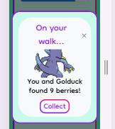

---

## Other Resolved Issues

- When using `ENTER` to press `Investigate` button it was sometimes really slow loading the next modal.
- When `Collect` button had been clicked, there was a blue background on the button - I changed this to a colour from my palette.
- When closing the rename wild pokémon modal by pressing `ESC` or `x`, `modalIsOpen` was still set to `true`, so the `Go For A Walk` button is disabled when it shouldn't be.
- `ENTER`/`ESC` didn't work for Wild Encounter modal, for clicking `Adopt`/`Run Away`/`x` buttons.
- Issue when pressing `ESC` with some modals due to type error.
- Images of starter pokémon having too much empty space around the actual image, so I crop off the blank space, from the top and bottom at some screen sizes, and edges at some sizes so that the images didn't take up too much of the selection box.
- The user was unable to feed a berry or pet their pokémon if the health is at 0 without the modal coming up, which should only come up when trying to battle.
- When on laptop or larger screen sizes, user collection was too condensed in the middle of the page and only showed 2 pokémon per row, so I expanded them to show 3 per row if space.
- Radio buttons weren't centralised in starter form when all 3 are next to each other on a smaller/medium screen.
- Added a limit to nickname renaming inputs.
- Progress bars were not filling the full width next to image and the interact button/progress bars were too long or short at some sizes.
- If `Add To Collection` starter button is clicked while still adding (whilst the button text had changed to `Adding...`), multiples of the same pokémon are added, when only 1 should have been.
- Modals were appearing in different places on the screen, alerts were centre and walks were top, so I changed it so they were all in the same place.
- The heights of starter boxes were uneven if the personalities were longer so became 2 lines, so I added a minimum height so all the boxes would line up at the bottom despite how many rows of text there were.
- A small line border was appearing between sections in modals, so I removed this.
- In the modal to rename a wild pokémon being adopted, the input box appeared next to the label for it, so I changed it to appear beneath.
- I changed the `line-height` for input labels, so that there weren't such big gaps between lines when the label was on more than 1 line.
- The rename input box looked too wide at smaller screen sizes so I amended this to look better.
- When a pokémon's health was at 0, and the user selected `Train With`, the level was still going up even though it shouldn't have been, and there should have been an alert modal which wasn't working, so I fixed both of these issues.

### Other Completed Steps

- Inside the `releasePokemon` function, I ensured the input box was cleared, radio button was deselected and the starter choice personalities were refreshed when the last pokémon was deleted which prompts the starter selection form to reappear.
- I added backwards image of pokémon of the pokémon joining on a walk, so that it looks like the pokémon is walking ahead of the user.
- I ensured the `ENTER` key will click `Confirm`/`Continue` button option on modals, and `ESC` key will click `Cancel` button option on modals.
- I ensured the footer stayed stuck to the bottom of the page no matter how high the main page content was.
- When a starter pokémon is selected, I changed the colour of the background/border to something different so it is clearer that a pokémon has been selected.
- I removed the original arrow in the dropdown button and replaced it with a [Font Awesome](https://fontawesome.com/) arrow so that it could be coloured using CSS.
- I ensured that in the starter form, the typing cursor is automatically placed in the input box below the `Give your Pokémon a name:` prompt, so that when the user types, it will appear in the input box without them having to click inside first.
- I ensured all `variable`/`id`/`class` names were consistent - all `id` and `class` names are all in `kebab-case`, with the exception of modal `id`s which are in `camelCase`.

---

# Deployment

The following steps outline how I created my project and cloned it locally from GitHub. You can use equivalent tools, apps or platforms based on your own device or preferences.

**GitHub**

- Firstly, I made a new repository in GitHub from the code institute template, with my chosen name for my project, which is `pokegotchi-using-pokeapi`. (I ensured that this was in *snake case*).

- I then copied the GitHub repository URL from the top of the page, as shown below.


**File Explorer**

- Once I had made a new repository, in 'File Explorer' on my local Windows device, I then navigated to the folder I wanted my project to be in, and right clicked to 'Open in Terminal'.


**Terminal**

- Then, after making sure I was still in the correct folder, I typed `git clone [link copied and pasted from GitHub address bar]` into the Terminal.

- Now a new folder will have been added to your 'File Explorer' which is linked to the GitHub repository.

**VS Code**

- Next, I opened the new project folder in my chosen IDE (in my case this is VS Code) and pushed to GitHub to ensure the connection had been made.

Then I set up the initial project structure:

- I created the main html page: `index.html`, and created the `assets` folder which I added a `css` folder `js` folder, and an `images` folder inside.

- I added a `style.css` stylesheet inside the `css` folder and linked it to my `index.html` file, testing that the link had worked.

- In my custom CSS file (`style.css`), I defined the colour palette and font styles as CSS variables to ensure consistent branding and design.

- I added a `script.js` file inside the `js` folder and linked it to my `index.html` file at the bottom of the body tag, testing that the link had worked.

- I then integrated Bootstrap, jQuery and Font Awesome by linking them into my `index.html`, and also imported my chosen Google Fonts to the `style.css` stylesheet by adding the import URL to the top.

- After verifying that all dependencies and styles were correctly linked, I staged, committed, and pushed these initial changes to the GitHub repository.

<!-- *[TO DO: Find out if this needs more]* -->

---

# Credits

## Technologies Used

### [GitHub](https://github.com/)
- I used GitHub to store and manage the source code for this project and track changes.

### [VS Code](https://code.visualstudio.com/)
- I used VS Code as my IDE to code and develop this website and to push to GitHub.

### [Google Fonts](https://fonts.google.com/)
- I used this to find and create an import URL so that I could use my 2 chosen fonts Monofett & Dongle.

### [Font Awesome](https://fontawesome.com/)
- I used Font Awesome to add icons to the website so that they could be coloured to match my design, specifically gender symbols in the Pokémon name Nidoran.

### [Bootstrap](https://getbootstrap.com/)
- I used Bootstrap templates for my navbar, modals, tip carousel, and its flexbox grid system for interchangeable sizes, e.g. for the Pokémon Profiles and Starter Selections.

### [Google](https://google.com/)
- I used Google to research features, troubleshoot issues, and find solutions for implementing various aspects of the website.

### [Notion](https://www.notion.com/)
- I used Notion to write up ideas, to do lists/issues that needed fixing, and paste screenshots etc.

### [ColorZilla (Chrome Extension)](https://www.colorzilla.com/)
- I used ColorZilla to extract precise colour codes from images and web pages, which I modified to use in my design.

### [Drawio](https://app.diagrams.net/)
- I used Drawio to make my wireframes.

### [Balsamiq](https://balsamiq.com/)
- I used Balsamiq to make a wireframe of the dropdown button options and what they do.

### [PokéAPI](https://pokeapi.co/)
- I used data from the PokéAPI API for pokémon names, types and images.

---

## Images Used

All images in this website are taken from [PokéAPI](https://pokeapi.co/), and are the property of Nintendo and The Pokémon Company.

---

## Acknowledgements

I would like to thank the team at Code Institute, the members of the Slack/Discord community, and my tutors/mentors for all of their help and support throughout this course and project.

---

# Other

## Possible Future Additions

- Add pokémon collection and inventory to local storage so that if window is closed/refreshed, the user's pokémon collection and inventory will remain.
- Add genders to pokémon.
- If a pokémon is too unhappy (i.e. when training) add a modal to advise you to play with it to increase its happiness.
- Add evolving to pokémon (once the pokémon has levelled up enough).
- Add a pokédex with all previously owned pokémon checked off.
- Image changes with low bars, eg. if low health, pokémon image is faded/if happiness bar is low, pokémon image is facing away.
- Make personalities make a difference to how much a status bar increases or decreases, or the likelihood of the pokémon joining for walks, etc.
- If pokémon image is clicked on, a speech bubble could appear and give hints, or say that it's hungry/needs healing etc if any bars are low.
- Add other areas for walk encounter text other than just "long grass" and have it randomly select one each time.
- Have clicking off any of the starter boxes (onto the screen anywhere else) deselect the currently selected starter.
- Change `Go For A Walk` button text to be `Walking` when investigating a wild pokémon and change back once modals are closed.
- Add specificity to pokémon that needs healing/feeding - "Your Pokémon {nickname of one with 0 status bar} needs feeding", and also for deleting or renaming too.
- Add listener that presses the `Go For Walk` button when the `W` key is pressed.
- Add in the second type if there is one in PokéAPI & join to the first with ` & `.
- Change location of `Interact with` dropdown menu to be to the right of the button, instead of in line with it.
- Remove the walk modal title and x on mobiles so that the full modal is visible with image and buttons are more accessible.

<!-- ### [Fixed Issue]

<details>
<summary>Issue & Solution:</summary>

**Issue:** [Issue.]

**Solution:** [Solution.]

</details> -->